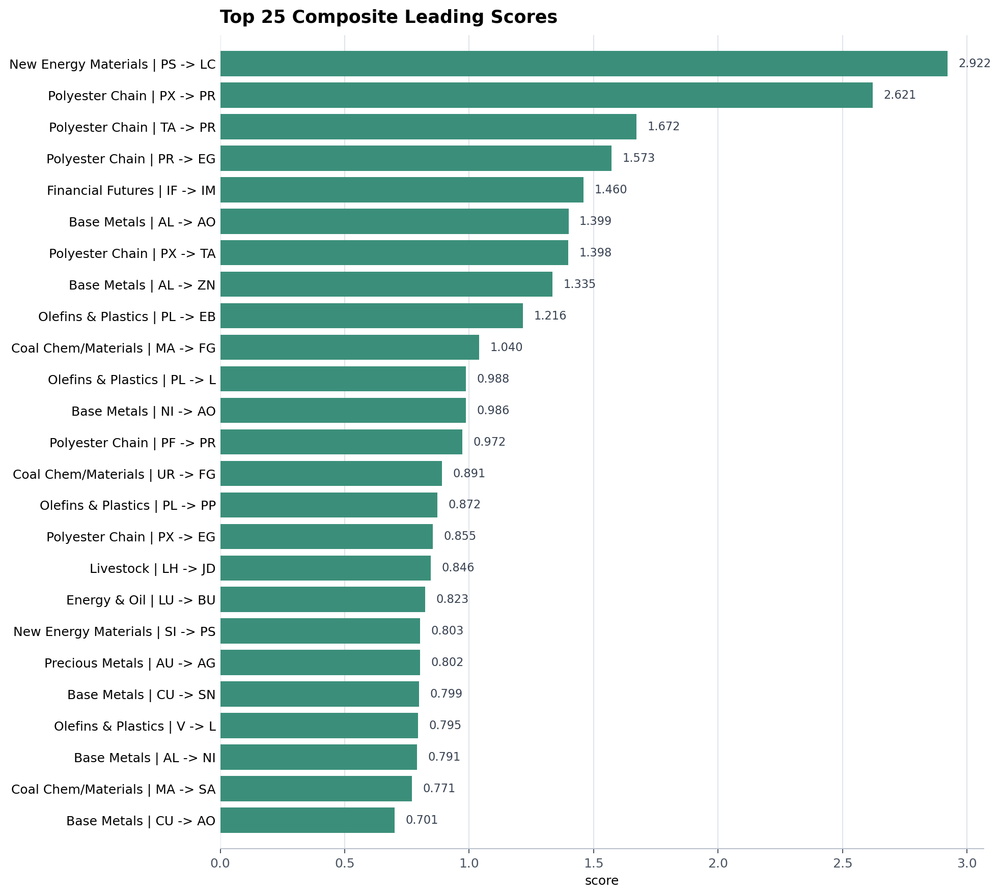
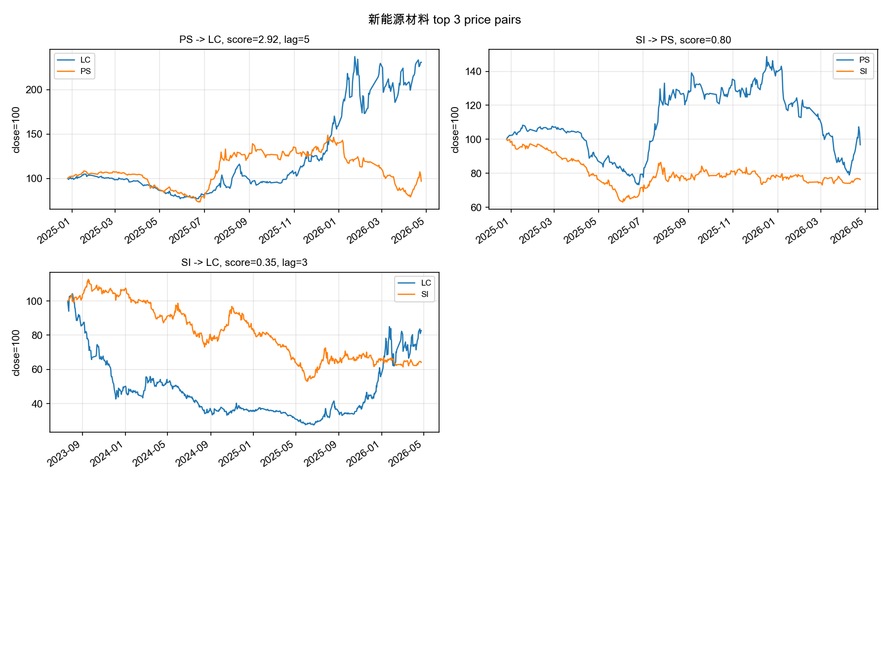
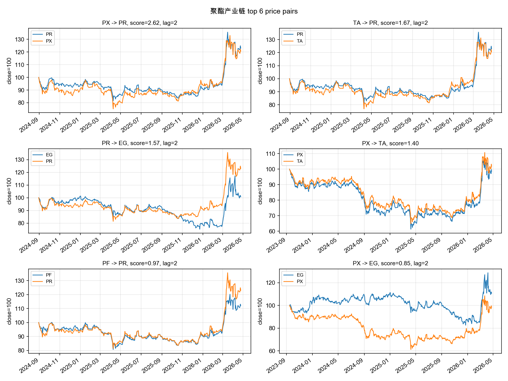
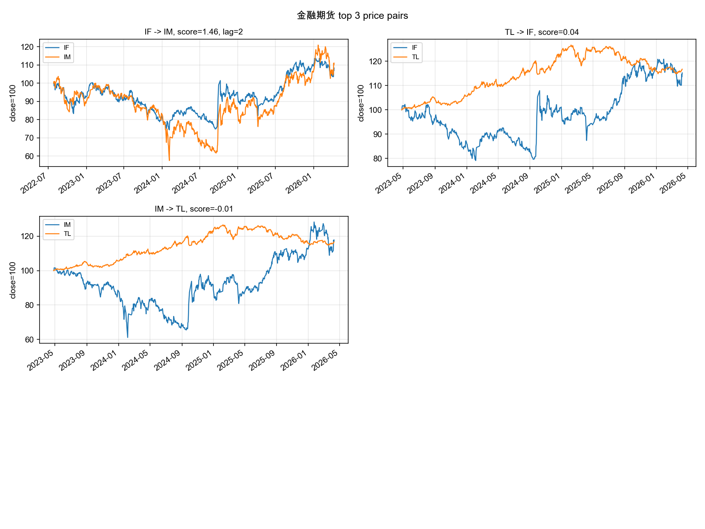
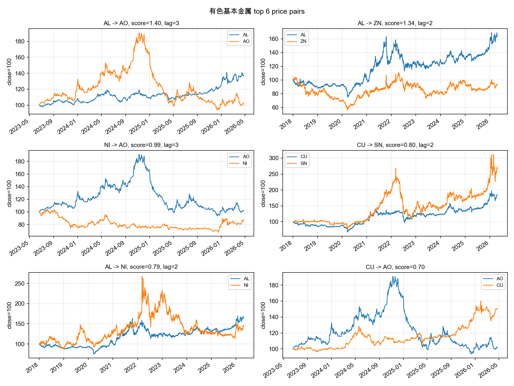
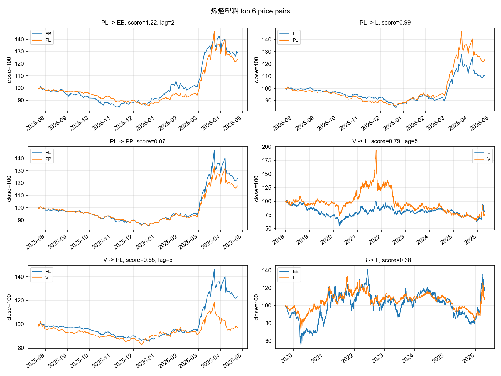
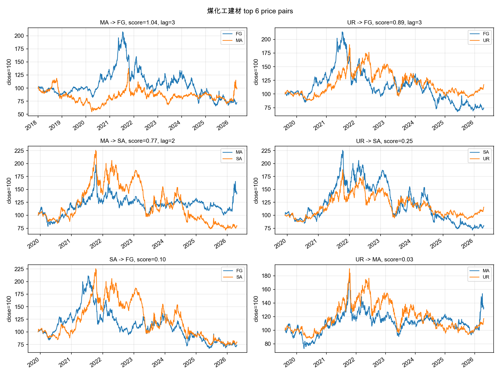
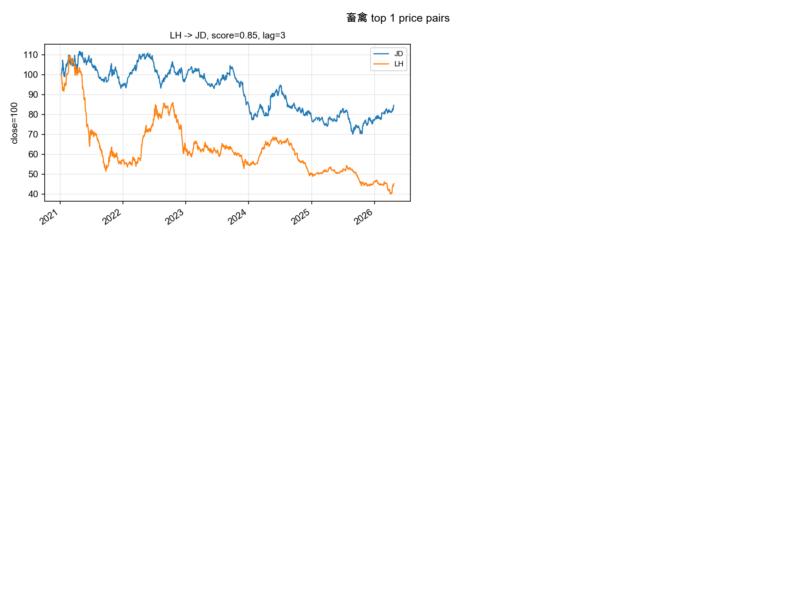
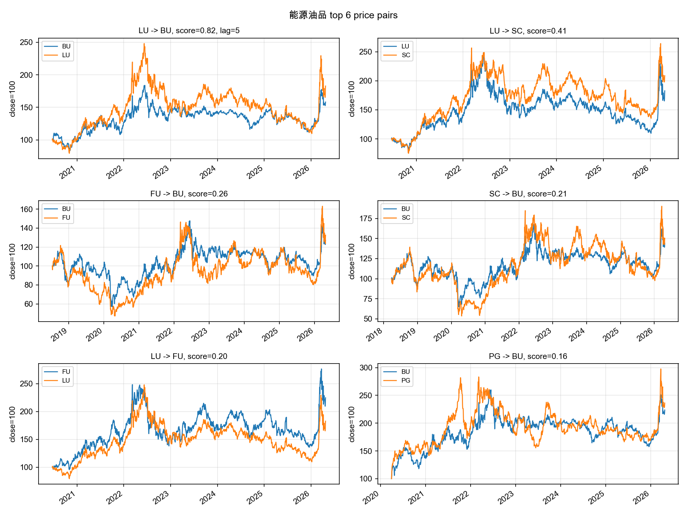
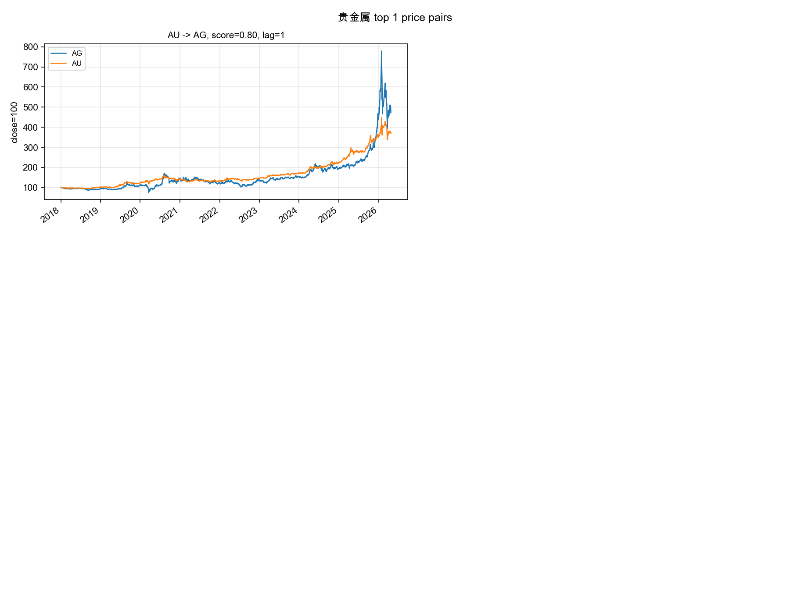

# Futures-Linkages 项目代码与结果分析报告

生成日期：2026-07-03  
阅读范围：`code/*.py` 全部 8 个脚本、`data/*.csv` 输入数据概况、`results/processed/` 下全部结果 CSV。

## 1 分组

| 分组 | 品种数 | 品种 |
| --- | ---: | --- |
| 有色基本金属 | 7 | `AL AO CU NI PB SN ZN` |
| 油脂油料 | 5 | `A B M PK RM` |
| 烯烃塑料 | 5 | `EB L PL PP V` |
| 聚酯产业链 | 5 | `EG PF PR PX TA` |
| 能源油品 | 5 | `BU FU LU PG SC` |
| 煤化工建材 | 4 | `FG MA SA UR` |
| 黑色钢矿 | 4 | `HC I RB SS` |
| 新能源材料 | 3 | `LC PS SI` |
| 橡胶 | 3 | `BR NR RU` |
| 软商品纺织 | 3 | `CF CY SR` |
| 金融期货 | 3 | `IF IM TL` |
| 果品 | 2 | `AP CJ` |
| 煤焦 | 2 | `J JM` |
| 畜禽 | 2 | `JD LH` |
| 谷物淀粉 | 2 | `C CS` |
| 贵金属 | 2 | `AG AU` |
| 铁合金 | 2 | `SF SM` |

## 2. 同步相关结果

本节对应 `instrument_corr_by_group.py`。对每个分组 `g`，先把日收益率转成矩阵：

$$
R_g[t,i] = r_{i,t}
$$

然后计算组内任意两个品种 `i,j` 的 Pearson 同步相关：

$$
\begin{aligned}
\rho_{i,j}
&= \mathrm{corr}(r_{i,t}, r_{j,t}) \\
&= \frac{\sum_t (r_{i,t}-\bar r_i)(r_{j,t}-\bar r_j)}
{\sqrt{\sum_t (r_{i,t}-\bar r_i)^2}\sqrt{\sum_t (r_{j,t}-\bar r_j)^2}}
\end{aligned}
$$

这个指标衡量两个品种是否同涨同跌，不包含领先方向。相关系数越接近 1，同向同步性越强；越接近 -1，反向同步性越强。

静态同日相关一共覆盖 91 个组内无向品种对，整体分布如下：

| 指标 | 数值 |
| --- | ---: |
| 均值 | 0.537 |
| 中位数 | 0.577 |
| 最大 | 0.980 |
| 最小 | -0.365 |

最强同步相关：

| 分组 | 品种对 | 相关系数 |
| --- | --- | ---: |
| 聚酯产业链 | `PX-TA` | 0.980 |
| 烯烃塑料 | `PL-PP` | 0.964 |
| 烯烃塑料 | `L-PL` | 0.945 |
| 黑色钢矿 | `HC-RB` | 0.942 |
| 橡胶 | `NR-RU` | 0.936 |
| 聚酯产业链 | `PF-PX` | 0.930 |
| 聚酯产业链 | `PR-TA` | 0.919 |
| 聚酯产业链 | `PR-PX` | 0.912 |
| 聚酯产业链 | `PF-PR` | 0.907 |
| 烯烃塑料 | `L-PP` | 0.903 |
| 能源油品 | `LU-SC` | 0.902 |
| 油脂油料 | `M-RM` | 0.879 |
| 能源油品 | `FU-SC` | 0.868 |
| 油脂油料 | `B-M` | 0.851 |
| 煤焦 | `J-JM` | 0.849 |
| 软商品纺织 | `CF-CY` | 0.837 |
| 谷物淀粉 | `C-CS` | 0.817 |
| 金融期货 | `IF-IM` | 0.784 |

最明显的负相关来自金融期货：

| 分组 | 品种对 | 相关系数 |
| --- | --- | ---: |
| 金融期货 | `IF-TL` | -0.365 |
| 金融期货 | `IM-TL` | -0.327 |

解释上，`IF/IM` 是权益指数期货，`TL` 是超长期国债期货，负相关符合权益和利率债在某些阶段的风险偏好差异。这部分更像资产配置或风险对冲信息。

分组均值上，聚酯产业链、烯烃塑料、能源油品、橡胶、煤焦、谷物淀粉的组内同步性较高；果品、畜禽、金融期货整体更分化，其中金融期货是因为 `TL` 与股指期货方向不同。

## 3. 滞后相关与方向性领先

本节对应 `lag_corr_by_group.py`。对 $k \in \{1,2,3,5\}$ 天滞后，代码用 `table.shift(-lag)` 将跟随品种的未来收益对齐到当前日，因此方向 $i \to j$ 的滞后相关为：

$$
\rho_{\mathrm{lag}}(i \to j,k) = \mathrm{corr}(r_{i,t}, r_{j,t+k})
$$

反方向为：

$$
\rho_{\mathrm{lag}}(j \to i,k) = \mathrm{corr}(r_{j,t}, r_{i,t+k})
$$

方向优势定义为两者之差：

$$
\mathrm{leadEdge}(i \to j,k)
= \rho_{\mathrm{lag}}(i \to j,k) - \rho_{\mathrm{lag}}(j \to i,k)
$$

筛选规则为：

$$
\begin{aligned}
\left|\rho_{\mathrm{lag}}(i \to j,k)\right| &\ge 0.05,\\
\mathrm{leadEdge}(i \to j,k) &\ge 0.05
\end{aligned}
$$

因此，进入 `lead_edges.csv` 的方向需要同时满足“自身滞后相关不太弱”和“相对反方向有明显优势”。

`lag_corr_by_group/lead_edges.csv` 使用阈值 $\left|\mathrm{lagCorr}\right| \ge 0.05$ 且 $\mathrm{leadEdge} \ge 0.05$ 筛选，最终得到 27 条方向性边。

| lag | 边数 |
| ---: | ---: |
| 1 | 4 |
| 2 | 11 |
| 3 | 7 |
| 5 | 5 |

领先差值最高的边：

| 分组 | lag | 领先 -> 跟随 | lag_corr | reverse | lead_edge |
| --- | ---: | --- | ---: | ---: | ---: |
| 新能源材料 | 5 | `PS -> LC` | 0.109 | -0.081 | 0.190 |
| 新能源材料 | 1 | `PS -> LC` | 0.053 | -0.080 | 0.134 |
| 聚酯产业链 | 2 | `PX -> PR` | 0.120 | -0.003 | 0.123 |
| 有色基本金属 | 3 | `AL -> AO` | 0.091 | -0.017 | 0.108 |
| 有色基本金属 | 3 | `NI -> AO` | 0.073 | -0.031 | 0.103 |
| 聚酯产业链 | 2 | `PF -> PR` | 0.114 | 0.016 | 0.098 |
| 聚酯产业链 | 2 | `PX -> EG` | 0.089 | -0.003 | 0.092 |
| 聚酯产业链 | 2 | `TA -> PR` | 0.097 | 0.008 | 0.089 |
| 金融期货 | 2 | `IF -> IM` | 0.078 | -0.009 | 0.087 |
| 烯烃塑料 | 5 | `V -> PL` | 0.161 | 0.080 | 0.082 |

滞后相关的有用信息集中在几个板块：有色基本金属、聚酯产业链、新能源材料、烯烃塑料、煤化工建材和金融期货。其中 `PS -> LC`、`PX -> PR`、`IF -> IM` 后续也被其他方法支持，可信度更高。

## 4. 残差相关结果

本节对应 `residual_corr_by_group.py`。残差处理先用同组其他品种构造等权共同因子。若分组 `g` 内有 `N_g` 个品种，则品种 `i` 的组内共同因子为：

$$
\mathrm{factor}_{i,t}
= \frac{1}{N_g-1}\sum_{j\in g,\,j\ne i} r_{j,t}
$$

随后对每个品种做一元线性回归：

$$
r_{i,t} = \alpha_i + \beta_i\*\mathrm{factor}_{i,t} + \varepsilon_{i,t}
$$

代码中 $\beta_i$ 和 $\alpha_i$ 由协方差公式估计：

$$
\begin{aligned}
\beta_i &= \frac{\mathrm{Cov}(r_i,\mathrm{factor}_i)}{\mathrm{Var}(\mathrm{factor}_i)} \\
\alpha_i &= \mathrm{mean}(r_i) - \beta_i\,\mathrm{mean}(\mathrm{factor}_i)
\end{aligned}
$$

残差为：

$$
\varepsilon_{i,t}=r_{i,t}-\alpha_i-\beta_i\*\mathrm{factor}_{i,t}
$$

然后在残差矩阵上重复同步相关与滞后领先计算：

$$
\begin{aligned}
\rho_{\mathrm{resid}}(i \to j,k)
&= \mathrm{corr}(\varepsilon_{i,t},\varepsilon_{j,t+k}) \\
\mathrm{residualLeadEdge}(i \to j,k)
&= \rho_{\mathrm{resid}}(i \to j,k) - \rho_{\mathrm{resid}}(j \to i,k)
\end{aligned}
$$

筛选规则与普通滞后领先相同，即残差滞后相关绝对值不低于 0.05，且残差方向优势不低于 0.05。

残差处理的逻辑是：对每个品种，用“组内其他品种收益均值”作为共同因子，计算剥离共同因子后的残差，再做同步相关和滞后领先。

残差领先边有 38 条，覆盖 11 个分组：

| 分组 | 残差领先边数 |
| --- | ---: |
| 聚酯产业链 | 11 |
| 烯烃塑料 | 8 |
| 有色基本金属 | 5 |
| 新能源材料 | 4 |
| 黑色钢矿 | 3 |
| 金融期货 | 2 |
| 橡胶 | 1 |
| 油脂油料 | 1 |
| 煤化工建材 | 1 |
| 能源油品 | 1 |
| 贵金属 | 1 |

残差领先最强的边：

| 分组 | lag | 领先 -> 跟随 | residual_lag_corr | reverse | residual_lead_edge |
| --- | ---: | --- | ---: | ---: | ---: |
| 聚酯产业链 | 2 | `PX -> PR` | 0.251 | -0.051 | 0.302 |
| 聚酯产业链 | 2 | `TA -> PR` | 0.192 | -0.074 | 0.265 |
| 烯烃塑料 | 2 | `L -> PL` | 0.100 | -0.156 | 0.256 |
| 烯烃塑料 | 5 | `L -> PL` | 0.104 | -0.147 | 0.251 |
| 烯烃塑料 | 2 | `PL -> EB` | 0.309 | 0.064 | 0.246 |
| 烯烃塑料 | 3 | `PL -> PP` | 0.242 | 0.015 | 0.227 |
| 新能源材料 | 5 | `PS -> LC` | 0.084 | -0.140 | 0.224 |
| 聚酯产业链 | 3 | `TA -> PR` | 0.064 | -0.157 | 0.222 |
| 聚酯产业链 | 3 | `PR -> EG` | 0.266 | 0.052 | 0.214 |
| 聚酯产业链 | 2 | `PR -> EG` | 0.085 | -0.120 | 0.205 |

残差结果比较有价值，因为它试图剥掉组内共同涨跌后留下更偏个体的信息。这里再次出现的 `PX -> PR`、`PS -> LC`、`IF -> IM`、`AL -> ZN`、`AU -> AG` 更值得保留。

不过，残差同步相关矩阵不宜直接当作经济上的“负相关”。例如两品种分组中，用对方作为唯一因子后，残差之间容易出现机械性的负相关。因此残差部分更适合看方向性领先边，而不是直接解释所有残差同步相关。

## 5. 滚动相关结果

本节对应 `rolling_corr_by_group.py`。滚动窗口为 $w \in \{20,60,120\}$，滞后为 $k \in \{1,2,3,5\}$。

滚动同步相关为：

$$
\mathrm{rollingCorr}_{i,j,t,w}
= \mathrm{corr}\left(
\{r_{i,\tau}\}_{\tau=t-w+1}^{t},
\{r_{j,\tau}\}_{\tau=t-w+1}^{t}
\right)
$$

滚动领先相关为：

$$
\mathrm{rollingLeadCorr}_{i\to j,t,w,k}
= \mathrm{corr}\left(
\{r_{i,\tau}\}_{\tau=t-w+1}^{t},
\{r_{j,\tau+k}\}_{\tau=t-w+1}^{t}
\right)
$$

反向滚动领先相关为：

$$
\mathrm{rollingLeadCorr}_{j\to i,t,w,k}
= \mathrm{corr}\left(
\{r_{j,\tau}\}_{\tau=t-w+1}^{t},
\{r_{i,\tau+k}\}_{\tau=t-w+1}^{t}
\right)
$$

方向强度定义为：

$$
\mathrm{leadStrength}(i \to j,t,w,k) = \mathrm{rollingLeadCorr}_{i\to j,t,w,k} - \mathrm{rollingLeadCorr}_{j\to i,t,w,k}
$$

综合得分中使用的滚动稳定性，是所有窗口、滞后、日期组合里方向强度为正的比例：

$$
\mathrm{rollingStability}(i \to j)
= \frac{\mathrm{count}\{(t,w,k):\mathrm{leadStrength}(i \to j,t,w,k)>0\}}{M}
$$

其中 $M$ 是该方向有效滚动观测数。这个指标强调“方向出现得是否稳定”，不是平均收益或交易胜率。

滚动相关使用 20/60/120 日窗口。

滚动同步相关中，长期稳定高相关的品种对和静态相关基本一致：

| 分组 | 品种对 | 滚动均值相关 | `corr > 0.5` 占比 |
| --- | --- | ---: | ---: |
| 聚酯产业链 | `PX-TA` | 0.972 | 1.000 |
| 聚酯产业链 | `PR-TA` | 0.957 | 1.000 |
| 聚酯产业链 | `PR-PX` | 0.939 | 1.000 |
| 黑色钢矿 | `HC-RB` | 0.939 | 1.000 |
| 聚酯产业链 | `PF-PR` | 0.935 | 1.000 |
| 橡胶 | `NR-RU` | 0.934 | 1.000 |
| 聚酯产业链 | `PF-TA` | 0.911 | 0.999 |
| 烯烃塑料 | `PL-PP` | 0.909 | 1.000 |
| 能源油品 | `LU-SC` | 0.895 | 0.997 |
| 烯烃塑料 | `L-PP` | 0.887 | 0.999 |

滚动领先方向稳定性最高的方向：

| 分组 | 领先 -> 跟随 | rolling_stability | 平均 lead_strength |
| --- | --- | ---: | ---: |
| 聚酯产业链 | `PX -> TA` | 0.719 | 0.024 |
| 有色基本金属 | `CU -> AO` | 0.630 | 0.041 |
| 聚酯产业链 | `PX -> PF` | 0.629 | 0.025 |
| 聚酯产业链 | `PX -> PR` | 0.626 | 0.030 |
| 烯烃塑料 | `EB -> PL` | 0.613 | 0.047 |
| 新能源材料 | `PS -> LC` | 0.594 | 0.058 |
| 烯烃塑料 | `PP -> L` | 0.587 | 0.016 |
| 能源油品 | `LU -> BU` | 0.580 | 0.035 |
| 软商品纺织 | `CF -> SR` | 0.579 | 0.039 |
| 有色基本金属 | `AL -> ZN` | 0.578 | 0.044 |
| 新能源材料 | `SI -> PS` | 0.578 | 0.027 |

注意：滚动领先文件同时包含 `A -> B` 和 `B -> A`，而 `lead_strength` 是两方向差值，所以全局汇总时正负会近似抵消，所有窗口/lag 的总体正向占比接近 0.5。这不是结果失效，而是指标定义的对称性。应该看单个方向的稳定性和平均强度。

## 6. Granger 与 VAR

### 6.1 Granger

解释 i 过去几天的收益率，能不能帮助预测 j 今天的收益率，看 i 对 j 是否有额外预测力。本小节对应 `granger_by_group.py`。以方向 $i \to j$ 为例，Granger 检验的核心回归是：

$$
r_{j,t} = c + \sum_{\ell=1}^{k} a_\ell r_{j,t-\ell} + \sum_{\ell=1}^{k} b_\ell r_{i,t-\ell} + u_t
$$

原假设为品种 `i` 不 Granger 导致品种 `j`：

$$
H_0: b_1=b_2=\cdots=b_k=0
$$

代码使用 `ssr_ftest` 的 p 值，并按：

$$
p < 0.05 \Rightarrow \mathrm{isGrangerSignificant}=\mathrm{True}
$$

判定显著性。综合得分中还会把最小 p 值映射成分段分数：

$$
\mathrm{grangerScore}(p)=
\begin{cases}
1.0, & p < 0.01 \\
0.7, & 0.01 \le p < 0.05 \\
0.4, & 0.05 \le p < 0.10 \\
0.0, & p \ge 0.10
\end{cases}
$$

Granger 检验结果：

| 指标 | 数值 |
| --- | ---: |
| 总检验行数 | 728 |
| `p < 0.05` 行数 | 174 |
| 显著唯一方向对 | 71 |

显著行数按 lag 分布：

| lag | 显著行数 |
| ---: | ---: |
| 1 | 29 |
| 2 | 42 |
| 3 | 47 |
| 5 | 56 |

最低 p 值的方向：

| 分组 | 领先 -> 跟随 | lag | p_value |
| --- | --- | ---: | ---: |
| 贵金属 | `AU -> AG` | 5 | 3.29e-11 |
| 贵金属 | `AU -> AG` | 2 | 7.36e-07 |
| 有色基本金属 | `AL -> ZN` | 2 | 3.99e-06 |
| 烯烃塑料 | `EB -> L` | 5 | 1.79e-05 |
| 烯烃塑料 | `EB -> PL` | 5 | 1.98e-05 |
| 能源油品 | `LU -> BU` | 5 | 2.23e-05 |
| 有色基本金属 | `CU -> NI` | 3 | 6.54e-05 |
| 有色基本金属 | `NI -> AL` | 1 | 9.08e-05 |
| 聚酯产业链 | `EG -> PR` | 5 | 9.53e-05 |
| 聚酯产业链 | `PR -> EG` | 5 | 1.22e-04 |
| 金融期货 | `IF -> IM` | 2 | 1.82e-04 |

### 6.2 VAR

把同一分组里的所有品种放在一个系统里，看“谁过去的收益能解释谁今天的收益”。本小节对应 `var_by_group.py`。对每个分组拟合 VAR 模型，滞后阶数 $p \in \{1,2,3,5\}$。设组内收益率向量为：

$$
\mathbf{r}_t = [r_{1,t}, r_{2,t}, \ldots, r_{N_g,t}]^\top
$$

VAR 模型为：（今天这一组品种的收益率 = 常数 + 过去几天这一组品种收益率的影响 + 误差）

$$
\mathbf{r}_t
= \mathbf{c} + \sum_{\ell=1}^{p} A_\ell \mathbf{r}_{t-\ell} + \mathbf{u}_t
$$

比如滞后阶数 p = 1，模型大概就是：

LC今天 = 常数 + LC昨天 + PS昨天 + SI昨天 + 误差

PS今天 = 常数 + LC昨天 + PS昨天 + SI昨天 + 误差

SI今天 = 常数 + LC昨天 + PS昨天 + SI昨天 + 误差

对方向 $i \to j$，关注的是 $A_\ell$ 中“品种 $i$ 的滞后收益解释品种 $j$ 当前收益”的系数：

$$
(A_\ell)_{j,i}
$$

也就是这一项的系数：
$$
r_{j,t} = \cdots + b \cdot r_{i,t-\ell} + \cdots
$$

显著性规则为：

$$
p_{\mathrm{VAR}} < 0.05 \Rightarrow \mathrm{isVarSignificant}=\mathrm{True}
$$

综合得分中 VAR 分数为：

$$
\mathrm{varScore}=
\begin{cases}
1.0, & p_{\mathrm{VAR}} < 0.05,\ (A_\ell)_{j,i} > 0 \\
0.5, & p_{\mathrm{VAR}} < 0.05,\ (A_\ell)_{j,i} < 0 \\
0.0, & \mathrm{otherwise}
\end{cases}
$$

VAR 结果：

| 指标 | 数值 |
| --- | ---: |
| 系数行数 | 2,651 |
| 显著系数行数 | 364 |
| 非自身显著系数行数 | 251 |
| 非自身显著唯一方向对 | 96 |

VAR p 值最低的非自身方向：

model_lag 是这个 VAR 模型总共用了过去几天的数据；
predictor_lag 是当前这一行系数具体对应过去第几天。

| 分组 | model_lag | predictor_lag | 领先 -> 跟随 | 系数 | p_value |
| --- | ---: | ---: | --- | ---: | ---: |
| 烯烃塑料 | 5 | 4 | `EB -> PP` | 0.506 | 2.57e-07 |
| 烯烃塑料 | 5 | 4 | `EB -> PL` | 0.586 | 4.49e-07 |
| 烯烃塑料 | 5 | 4 | `EB -> L` | 0.497 | 4.85e-07 |
| 贵金属 | 5 | 4 | `AU -> AG` | 0.290 | 1.12e-06 |
| 有色基本金属 | 3 | 3 | `NI -> SN` | 0.277 | 1.11e-05 |
| 聚酯产业链 | 3 | 3 | `PR -> EG` | 0.664 | 2.14e-05 |
| 聚酯产业链 | 5 | 2 | `TA -> PR` | -1.180 | 5.44e-05 |
| 有色基本金属 | 5 | 4 | `SN -> NI` | -0.155 | 5.61e-05 |
| 聚酯产业链 | 5 | 2 | `TA -> PX` | -1.396 | 7.18e-05 |
| 聚酯产业链 | 5 | 2 | `PX -> PR` | 0.890 | 1.04e-04 |
| 黑色钢矿 | 2 | 2 | `I -> HC` | 0.078 | 3.22e-04 |
| 金融期货 | 3 | 1 | `IF -> IM` | 0.293 | 2.05e-03 |

VAR 的优点是同时控制同组其他变量，缺点是短样本新品种和多变量缺失会压缩有效样本。报告中应优先采用“VAR 与其他方法同向”的组合。

## 7. 综合领先得分

本节对应 `leading_score_by_group.py`。综合得分先按方向合并滞后相关、残差领先、滚动稳定性、Granger 和 VAR。对连续型指标使用标准化：

$$
z(x)=\frac{x-\mathrm{mean}(x)}{\mathrm{std}(x)}
$$

若某列标准差为 0，则标准化后全为 0。最终得分公式为：

$$
\begin{aligned}
\mathrm{score}(i \to j) &= 0.25\,z(\mathrm{lagDiff}) + 0.20\,z(\mathrm{residualLeadEdge}) \\ &\quad + 0.20\,z(\mathrm{rollingStability}) + 0.20\,\mathrm{grangerScore} + 0.15\,\mathrm{varScore} 
\end{aligned}
$$

没有进入滞后或残差筛选的方向，对应字段填 0。这个分数是研究排序指标，不是收益预测值，也不是交易胜率。

`leading_scores.csv` 有 182 个方向对。得分分布：

| 指标 | 数值 |
| --- | ---: |
| 均值 | 0.141 |
| 中位数 | 0.002 |
| 最大 | 2.922 |
| 最小 | -0.728 |
| 正分方向数 | 91 |

综合得分前 25：

| 排名 | 分组 | 领先 -> 跟随 | score | best_lag | lag_diff | residual_lag_corr | rolling_stability | granger_p | var_p |
| ---: | --- | --- | ---: | ---: | ---: | ---: | ---: | ---: | ---: |
| 1 | 新能源材料 | `PS -> LC` | 2.922 | 5 | 0.190 | 0.084 | 0.594 | 0.0285 | 0.00617 |
| 2 | 聚酯产业链 | `PX -> PR` | 2.621 | 2 | 0.123 | 0.251 | 0.626 | 0.2155 | 0.00010 |
| 3 | 聚酯产业链 | `TA -> PR` | 1.672 | 2 | 0.089 | 0.192 | 0.508 | 0.3331 | 0.00005 |
| 4 | 聚酯产业链 | `PR -> EG` | 1.573 | 2 | 0.080 | 0.266 | 0.480 | 0.00012 | 0.00002 |
| 5 | 金融期货 | `IF -> IM` | 1.460 | 2 | 0.087 | 0.135 | 0.531 | 0.00018 | 0.00205 |
| 6 | 有色基本金属 | `AL -> AO` | 1.399 | 3 | 0.108 | 0.101 | 0.492 | 0.1177 | 0.01909 |
| 7 | 聚酯产业链 | `PX -> TA` | 1.398 | NA | 0.000 | 0.069 | 0.719 | 0.00162 | 0.00273 |
| 8 | 有色基本金属 | `AL -> ZN` | 1.335 | 2 | 0.074 | 0.061 | 0.578 | 0.000004 | 0.21327 |
| 9 | 烯烃塑料 | `PL -> EB` | 1.216 | 2 | 0.066 | 0.309 | 0.387 | 0.00890 | 0.04223 |
| 10 | 煤化工建材 | `MA -> FG` | 1.040 | 3 | 0.078 | 0.060 | 0.502 | 0.00147 | 0.00191 |
| 11 | 烯烃塑料 | `PL -> L` | 0.988 | NA | 0.000 | 0.160 | 0.564 | 0.00688 | 0.03304 |
| 12 | 有色基本金属 | `NI -> AO` | 0.986 | 3 | 0.103 | 0.000 | 0.571 | 0.4977 | 0.11814 |
| 13 | 聚酯产业链 | `PF -> PR` | 0.972 | 2 | 0.098 | 0.123 | 0.451 | 0.1162 | 0.00444 |
| 14 | 煤化工建材 | `UR -> FG` | 0.891 | 3 | 0.068 | 0.000 | 0.549 | 0.03799 | 0.04719 |
| 15 | 烯烃塑料 | `PL -> PP` | 0.872 | NA | 0.000 | 0.242 | 0.477 | 0.02228 | 0.02061 |
| 16 | 聚酯产业链 | `PX -> EG` | 0.855 | 2 | 0.092 | 0.000 | 0.525 | 0.01254 | 0.19154 |
| 17 | 畜禽 | `LH -> JD` | 0.846 | 3 | 0.068 | 0.000 | 0.538 | 0.04507 | 0.02669 |
| 18 | 能源油品 | `LU -> BU` | 0.823 | 5 | 0.057 | 0.000 | 0.580 | 0.00002 | 0.10543 |
| 19 | 新能源材料 | `SI -> PS` | 0.803 | NA | 0.000 | 0.107 | 0.578 | 0.09160 | 0.00773 |
| 20 | 贵金属 | `AU -> AG` | 0.802 | 1 | 0.052 | 0.113 | 0.495 | 3.29e-11 | 1.12e-06 |
| 21 | 有色基本金属 | `CU -> SN` | 0.799 | 2 | 0.071 | 0.000 | 0.502 | 0.00909 | 0.02036 |
| 22 | 烯烃塑料 | `V -> L` | 0.795 | 5 | 0.070 | 0.000 | 0.542 | 0.00938 | 0.43084 |
| 23 | 有色基本金属 | `AL -> NI` | 0.791 | 2 | 0.080 | 0.000 | 0.500 | 0.00025 | 0.04336 |
| 24 | 煤化工建材 | `MA -> SA` | 0.771 | 2 | 0.053 | 0.000 | 0.535 | 0.00288 | 0.00432 |
| 25 | 有色基本金属 | `CU -> AO` | 0.701 | NA | 0.000 | 0.058 | 0.630 | 0.20116 | 0.01695 |

每个分组的最高得分方向：

| 分组 | 领先 -> 跟随 | score |
| --- | --- | ---: |
| 新能源材料 | `PS -> LC` | 2.922 |
| 聚酯产业链 | `PX -> PR` | 2.621 |
| 金融期货 | `IF -> IM` | 1.460 |
| 有色基本金属 | `AL -> AO` | 1.399 |
| 烯烃塑料 | `PL -> EB` | 1.216 |
| 煤化工建材 | `MA -> FG` | 1.040 |
| 畜禽 | `LH -> JD` | 0.846 |
| 能源油品 | `LU -> BU` | 0.823 |
| 贵金属 | `AU -> AG` | 0.802 |
| 黑色钢矿 | `I -> HC` | 0.561 |
| 油脂油料 | `A -> PK` | 0.480 |
| 橡胶 | `RU -> BR` | 0.458 |
| 谷物淀粉 | `C -> CS` | 0.396 |
| 软商品纺织 | `CF -> SR` | 0.282 |
| 铁合金 | `SM -> SF` | 0.266 |
| 果品 | `AP -> CJ` | 0.055 |
| 煤焦 | `J -> JM` | 0.051 |

支持方法数量分布：

| 支持方法数 | 方向数 |
| ---: | ---: |
| 0 | 62 |
| 1 | 39 |
| 2 | 47 |
| 3 | 24 |
| 4 | 9 |
| 5 | 1 |

所以报告里真正应该重点讨论的不是全部 182 个方向，而是支持方法数 >= 3 或 score 明显靠前的 34 个左右方向。

## 8. 有用发现与应用建议

### 8.1 适合作为领先因子的候选

更适合进入后续建模或人工盯盘的方向：

- `PS -> LC`：综合最强，但 `PS` 样本只有 320 个日频点，必须样本外验证。
- `PX -> PR`、`TA -> PR`、`PF -> PR`、`PR -> EG`：聚酯链内部的上下游/相近品种联动最密集，是最值得深入的板块。
- `IF -> IM`：金融期货中股指期货内部方向较清楚，`TL` 更像对冲/风险偏好变量。
- `AL -> ZN`、`AL -> AO`、`CU -> SN`、`NI -> AO`：有色内部存在多个方向性线索，但方向之间有交叉，需要进一步做多变量验证。
- `MA -> FG`、`MA -> SA`、`UR -> FG`：煤化工建材板块有可跟踪方向。
- `AU -> AG`：贵金属中金领先银的统计证据很强，适合作为跨品种相对强弱研究。

### 8.2 适合作为价差或风险归并候选

同步相关极强、滚动同步也稳定的品种对：

- 聚酯：`PX-TA`、`PR-TA`、`PR-PX`、`PF-PR`、`PF-TA`
- 烯烃塑料：`PL-PP`、`L-PP`、`L-PL`
- 黑色：`HC-RB`
- 橡胶：`NR-RU`
- 能源：`LU-SC`、`FU-SC`、`FU-LU`
- 油脂油料：`M-RM`、`B-M`
- 谷物：`C-CS`

这些关系不一定有方向性，但对风险暴露合并、同产业品种替代、价差跟踪、异常偏离监控很有用。

### 8.3 相对弱或需谨慎的板块

- 果品和畜禽同步相关较弱，组内只有两个品种，统计维度也有限。
- 新能源材料综合最高的 `PS -> LC` 很突出，但样本较短，且品种上市时间差异大。
- 烯烃塑料里的 `PL` 样本极短，虽然多个结果显示强信号，但最容易被近期行情或上市初期特征影响。
- 金融期货中 `TL` 与 `IF/IM` 是不同资产属性，不应和商品产业链关系同等解释。

## 9. 结论

这个项目已经完成了一套较完整的期货组内联动挖掘流程。结果中最有价值的是两类信息：

第一类是同步高相关关系，用于价差、替代品、风险聚类和异常偏离监控。聚酯、烯烃塑料、黑色、橡胶、能源、油脂油料里的高相关对都很清楚。

第二类是多方法支持的领先候选，用于后续建模和交易假设生成。当前最值得优先验证的是 `PS -> LC`、`PX -> PR`、`PR -> EG`、`IF -> IM`、`PL -> EB`、`MA -> FG`、`AL -> ZN`、`AU -> AG`。
