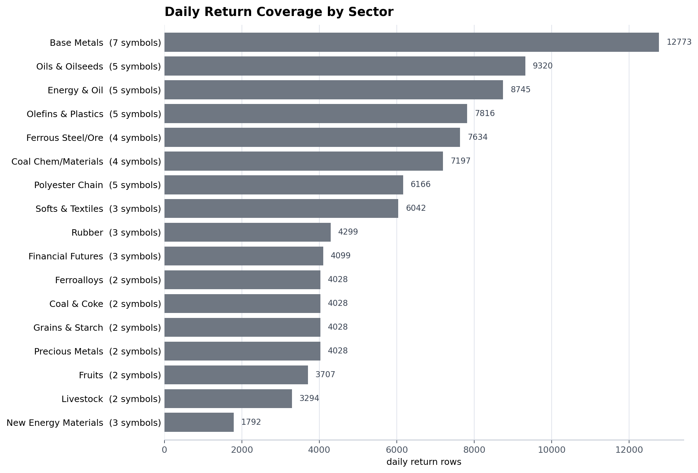
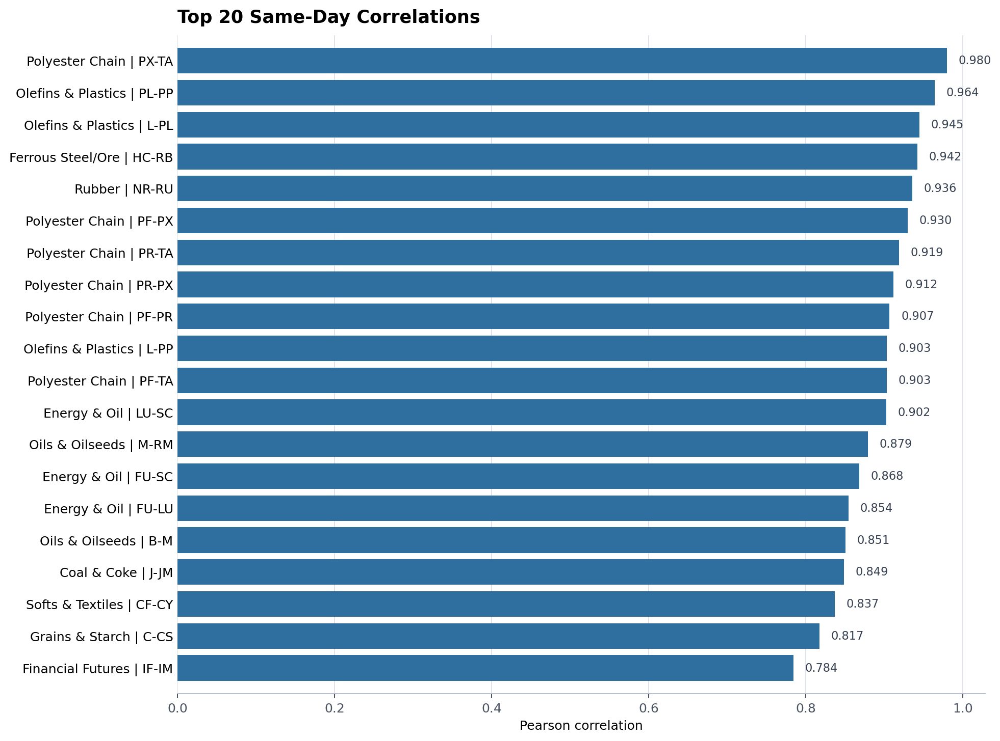
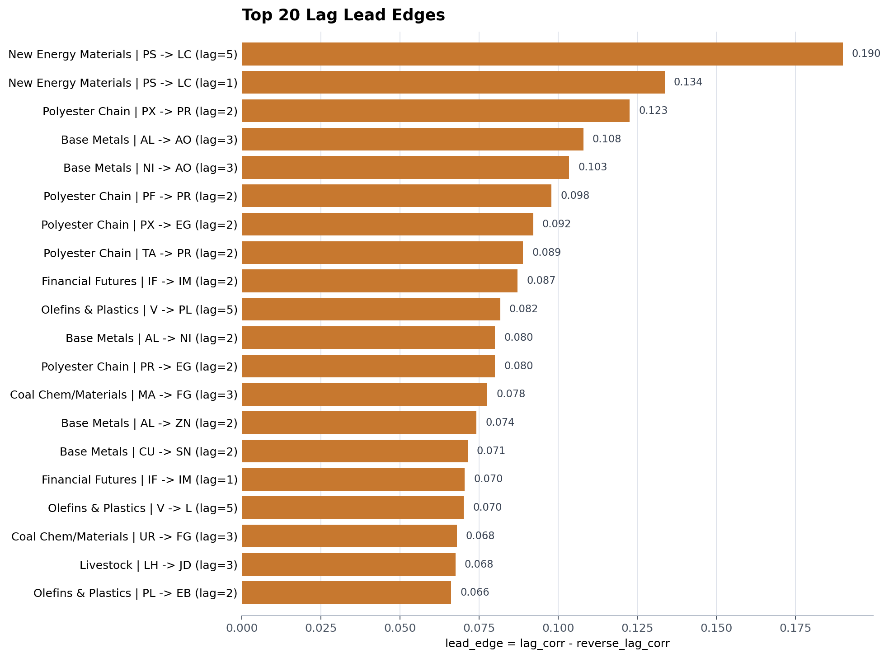
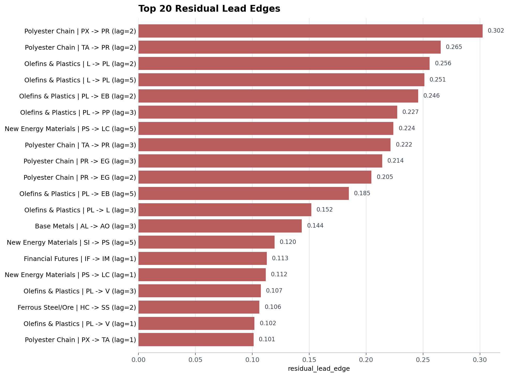
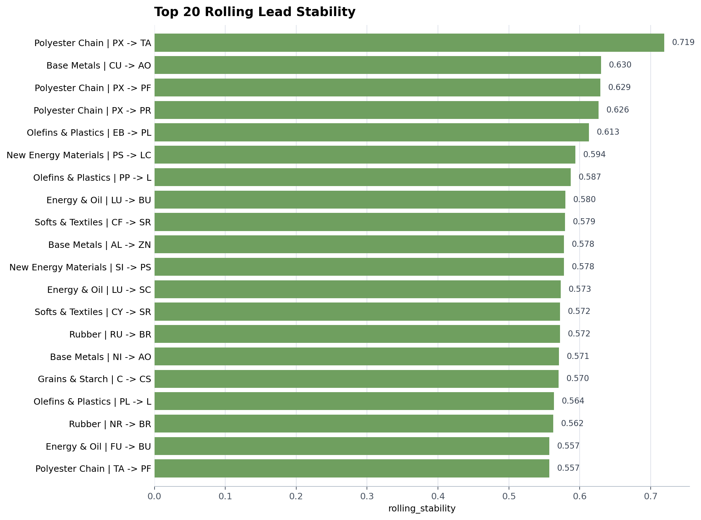
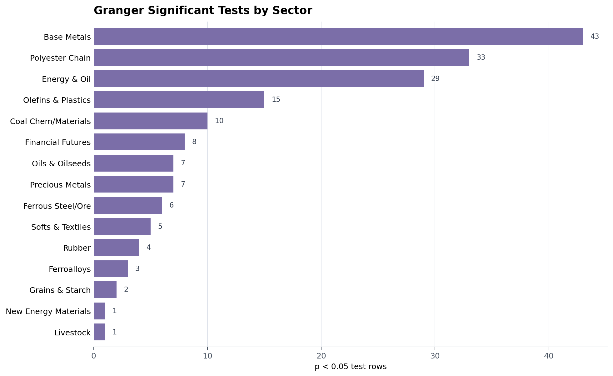
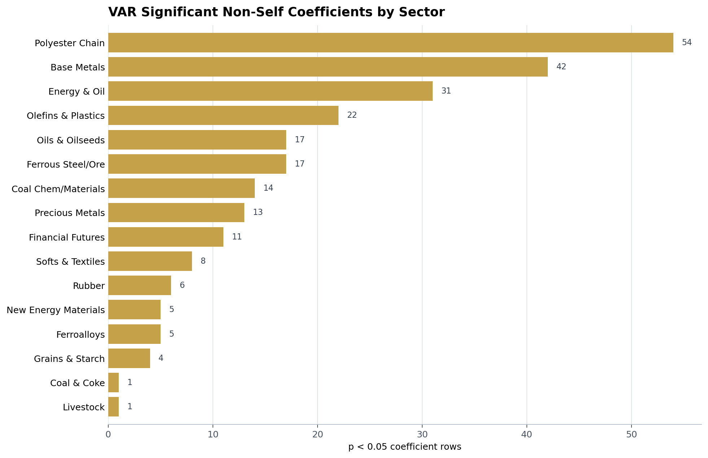

# Futures-Linkages 项目代码与结果分析报告

生成日期：2026-07-03  
阅读范围：`code/*.py` 全部 8 个脚本、`data/*.csv` 输入数据概况、`results/processed/` 下全部结果 CSV。

## 1. 核心结论

这个项目的目标不是训练预测模型，也不是完整交易回测，而是把 59 个期货品种按 17 个产业/资产组归类后，在日频收益率层面寻找组内联动、同步相关和潜在领先关系。

最有用的产物是 `results/processed/leading_score_by_group/leading_scores.csv`。它把滞后相关、残差滞后相关、滚动方向稳定性、Granger 检验和 VAR 系数合成到一个领先得分里。按多方法交叉支持来看，较值得优先跟踪的方向包括：

| 优先级 | 板块 | 领先 -> 跟随 | 主要依据 |
| --- | --- | --- | --- |
| A | 新能源材料 | `PS -> LC` | 唯一同时得到 5 类证据支持的组合；综合得分最高，`score=2.922` |
| B | 聚酯产业链 | `PX -> PR` | 滞后相关、残差领先、滚动稳定、VAR 同时支持；`score=2.621` |
| B | 聚酯产业链 | `PR -> EG` | 残差领先强，Granger 和 VAR 显著；`score=1.573` |
| B | 金融期货 | `IF -> IM` | 滞后相关、残差、Granger、VAR 同向支持；`score=1.460` |
| B | 烯烃塑料 | `PL -> EB` | 残差领先很强，Granger 和 VAR 显著；但 `PL` 样本短 |
| B | 煤化工建材 | `MA -> FG` | 滞后相关、残差、Granger、VAR 均支持 |
| B | 有色基本金属 | `AL -> ZN` | 滞后、残差、滚动稳定和 Granger 支持 |
| B | 贵金属 | `AU -> AG` | Granger 和 VAR 极显著，滞后/残差也有支持 |

同步相关方面，产业链关系很清楚：聚酯、烯烃塑料、黑色钢矿、橡胶、能源油品、油脂油料里有多组相关性非常高的品种。最强的同步相关包括 `PX-TA`、`PL-PP`、`L-PL`、`HC-RB`、`NR-RU`、`LU-SC`、`M-RM`。这些更适合做风险暴露归并、价差/相对价值候选池，而不是直接作为领先信号。

需要注意：所有显著性结果都是原始 p 值，没有多重检验校正，也没有样本外回测。当前结果适合作为“候选关系挖掘”和“研究线索”，还不能直接视为可交易信号。

## 2. 项目结构与代码流程

### 2.1 文件结构

| 路径 | 内容 |
| --- | --- |
| `data/` | 59 个原始分钟级 CSV，合计约 34,105,680 行 |
| `code/process.py` | 数据归类、夜盘交易日映射、分钟转日频、日收益率生成 |
| `code/instrument_corr_by_group.py` | 按组计算品种间日收益率静态相关矩阵 |
| `code/lag_corr_by_group.py` | 按 1/2/3/5 日滞后计算方向性领先相关 |
| `code/rolling_corr_by_group.py` | 按 20/60/120 日窗口计算滚动同步相关和滚动领先相关 |
| `code/granger_by_group.py` | 按组做 Granger 因果检验 |
| `code/var_by_group.py` | 按组拟合 VAR，输出滞后项系数和 p 值 |
| `code/residual_corr_by_group.py` | 用组内等权因子剥离共同波动后，再做残差相关和残差领先 |
| `code/leading_score_by_group.py` | 合并各类证据，生成综合领先得分 |
| `results/processed/` | 所有处理后数据和分析结果 |

`.gitignore` 中忽略了 `data/` 和 `results/`，说明这些大文件结果不打算纳入 Git 版本管理。

### 2.2 数据处理逻辑

`process.py` 定义了 17 个分组，并将原始分钟 K 线聚合为日频：

- 日频字段包括 `open/high/low/close/volume/total_turnover/open_interest`。
- `trade_date` 会把 21 点以后夜盘映射到下一个白天交易日。
- 日收益率使用同一品种按 `close` 做 `pct_change()`，输出到 `symbol_returns.csv`。
- 每个分组另存一份日频 K 线到 `results/processed/by_group/`。

一个值得记录的实现细节：夜盘映射依赖同一品种白天 9-15 点出现过的日期作为交易日历。如果某个品种或某段数据白天记录异常缺失，交易日映射可能被最近日历日期吸收，需要在严谨生产环境中额外校验。

### 2.3 领先关系定义

项目里有几种“领先”的定义：

| 方法 | 口径 |
| --- | --- |
| 滞后相关 | `corr(leader_t, follower_{t+lag})` 与反方向差值 `lead_edge` |
| 残差滞后相关 | 先用组内其他品种均值作为因子剥离共同波动，再重复滞后相关 |
| 滚动领先 | 在 20/60/120 日窗口中计算方向差 `lead_strength = lead - reverse` |
| Granger | 检验 leader 的滞后项是否帮助解释 follower |
| VAR | 组内多变量 VAR 中，leader 滞后项对 follower 方程的系数和 p 值 |
| 综合得分 | 对若干指标标准化或打分后加权合成 |

综合得分权重：

| 组件 | 权重 |
| --- | ---: |
| 滞后相关差 `lag_diff` | 0.25 |
| 残差领先差 `residual_lead_edge` | 0.20 |
| 滚动方向稳定性 `rolling_stability` | 0.20 |
| Granger 分数 | 0.20 |
| VAR 分数 | 0.15 |

## 3. 数据覆盖与结果产物

本节结果来自 `process.py`。设品种为 `i`，分钟时点为 `m`，交易日为 `t`，日收盘价为 `C[i,t]`，日收益率为 `r[i,t]`。夜盘分钟先映射到下一白天交易日：

```text
target_date[m] = date[m] + 1{hour[m] >= 21}
trade_date[m] = min { d in Calendar[i] : d >= target_date[m] }
```

其中 `Calendar[i]` 是该品种白天 9 点到 15 点出现过的交易日集合。随后按 `symbol + trade_date` 聚合分钟 K 线：

```text
O[i,t]  = first(open)
H[i,t]  = max(high)
L[i,t]  = min(low)
C[i,t]  = last(close)
V[i,t]  = sum(volume)
T[i,t]  = sum(total_turnover)
OI[i,t] = last(open_interest)
```

日收益率使用简单收益率：

```text
r[i,t] = C[i,t] / C[i,t-1] - 1
```

因此，后续所有相关、领先、Granger 和 VAR 统计都基于日收益率矩阵，而不是分钟级原始数据。



### 3.1 数据覆盖

| 指标 | 数值 |
| --- | ---: |
| 原始 CSV 数量 | 59 |
| 原始分钟记录数 | 34,105,680 |
| 品种数 | 59 |
| 分组数 | 17 |
| 日频 K 线记录 | 99,055 |
| 日收益率记录 | 98,996 |
| 主日期范围 | 2016-01-07 至 2026-04-24 |
| 金融期货结束日期 | 2026-04-10 |
| 未分类品种 | 0 |
| `symbol + trade_date` 重复 | 0 |
| `close` 缺失 | 0 |
| `return` 缺失 | 0 |

样本长度差异较大的品种需要谨慎解读：

| 品种 | 分组 | 起始日 | 结束日 | 日频点数 |
| --- | --- | --- | --- | ---: |
| `PL` | 烯烃塑料 | 2025-07-22 | 2026-04-24 | 184 |
| `PS` | 新能源材料 | 2024-12-26 | 2026-04-24 | 320 |
| `PR` | 聚酯产业链 | 2024-08-30 | 2026-04-24 | 397 |
| `PX` | 聚酯产业链 | 2023-09-15 | 2026-04-24 | 628 |
| `BR` | 橡胶 | 2023-07-28 | 2026-04-24 | 663 |
| `LC` | 新能源材料 | 2023-07-21 | 2026-04-24 | 668 |
| `AO` | 有色基本金属 | 2023-06-19 | 2026-04-24 | 690 |
| `TL` | 金融期货 | 2023-04-26 | 2026-04-10 | 715 |
| `SI` | 新能源材料 | 2022-12-22 | 2026-04-24 | 807 |
| `IM` | 金融期货 | 2022-07-27 | 2026-04-10 | 897 |

### 3.2 分组

| 分组 | 品种数 | 品种 |
| --- | ---: | --- |
| 有色基本金属 | 7 | `AL AO CU NI PB SN ZN` |
| 油脂油料 | 5 | `A B M PK RM` |
| 烯烃塑料 | 5 | `EB L PL PP V` |
| 聚酯产业链 | 5 | `EG PF PR PX TA` |
| 能源油品 | 5 | `BU FU LU PG SC` |
| 煤化工建材 | 4 | `FG MA SA UR` |
| 黑色钢矿 | 4 | `HC I RB SS` |
| 新能源材料 | 3 | `LC PS SI` |
| 橡胶 | 3 | `BR NR RU` |
| 软商品纺织 | 3 | `CF CY SR` |
| 金融期货 | 3 | `IF IM TL` |
| 果品 | 2 | `AP CJ` |
| 煤焦 | 2 | `J JM` |
| 畜禽 | 2 | `JD LH` |
| 谷物淀粉 | 2 | `C CS` |
| 贵金属 | 2 | `AG AU` |
| 铁合金 | 2 | `SF SM` |

### 3.3 结果文件规模

| 结果文件或目录 | 行数/文件数 |
| --- | ---: |
| `daily_bars.csv` | 99,055 行 |
| `symbol_returns.csv` | 98,996 行 |
| `instrument_groups.csv` | 59 行 |
| `by_group/` | 17 个分组文件 |
| `instrument_corr_by_group/` | 17 个相关矩阵 |
| `lag_corr_by_group/lead_edges.csv` | 27 行 |
| `lag_corr_by_group/lag_*/*.csv` | 68 个矩阵 |
| `residual_corr_by_group/residual_lead_edges.csv` | 38 行 |
| `residual_corr_by_group/lag_corr/lag_*/*.csv` | 68 个矩阵 |
| `granger_by_group/granger_results.csv` | 728 行 |
| `granger_by_group/significant_granger_edges.csv` | 174 行 |
| `var_by_group/var_coefficients.csv` | 2,651 行 |
| `var_by_group/significant_var_coefficients.csv` | 364 行 |
| `rolling_corr_by_group/rolling_same_time_corr.csv` | 375,472 行 |
| `rolling_corr_by_group/rolling_lead_corr.csv` | 2,997,770 行 |
| `leading_score_by_group/leading_scores.csv` | 182 行 |

## 4. 同步相关结果

本节对应 `instrument_corr_by_group.py`。对每个分组 `g`，先把日收益率转成矩阵：

```text
R_g[t,i] = r[i,t]
```

然后计算组内任意两个品种 `i,j` 的 Pearson 同步相关：

```text
rho[i,j] = corr(r[i,t], r[j,t])

         = sum_t((r[i,t] - mean(r[i])) * (r[j,t] - mean(r[j])))
           / sqrt(sum_t((r[i,t] - mean(r[i]))^2))
           / sqrt(sum_t((r[j,t] - mean(r[j]))^2))
```

这个指标衡量两个品种是否同涨同跌，不包含领先方向。相关系数越接近 1，同向同步性越强；越接近 -1，反向同步性越强。



静态同日相关一共覆盖 91 个组内无向品种对，整体分布如下：

| 指标 | 数值 |
| --- | ---: |
| 均值 | 0.537 |
| 中位数 | 0.577 |
| 最大 | 0.980 |
| 最小 | -0.365 |

最强同步相关：

| 分组 | 品种对 | 相关系数 |
| --- | --- | ---: |
| 聚酯产业链 | `PX-TA` | 0.980 |
| 烯烃塑料 | `PL-PP` | 0.964 |
| 烯烃塑料 | `L-PL` | 0.945 |
| 黑色钢矿 | `HC-RB` | 0.942 |
| 橡胶 | `NR-RU` | 0.936 |
| 聚酯产业链 | `PF-PX` | 0.930 |
| 聚酯产业链 | `PR-TA` | 0.919 |
| 聚酯产业链 | `PR-PX` | 0.912 |
| 聚酯产业链 | `PF-PR` | 0.907 |
| 烯烃塑料 | `L-PP` | 0.903 |
| 能源油品 | `LU-SC` | 0.902 |
| 油脂油料 | `M-RM` | 0.879 |
| 能源油品 | `FU-SC` | 0.868 |
| 油脂油料 | `B-M` | 0.851 |
| 煤焦 | `J-JM` | 0.849 |
| 软商品纺织 | `CF-CY` | 0.837 |
| 谷物淀粉 | `C-CS` | 0.817 |
| 金融期货 | `IF-IM` | 0.784 |

最明显的负相关来自金融期货：

| 分组 | 品种对 | 相关系数 |
| --- | --- | ---: |
| 金融期货 | `IF-TL` | -0.365 |
| 金融期货 | `IM-TL` | -0.327 |

解释上，`IF/IM` 是权益指数期货，`TL` 是超长期国债期货，负相关符合权益和利率债在某些阶段的风险偏好差异。这部分更像资产配置或风险对冲信息。

分组均值上，聚酯产业链、烯烃塑料、能源油品、橡胶、煤焦、谷物淀粉的组内同步性较高；果品、畜禽、金融期货整体更分化，其中金融期货是因为 `TL` 与股指期货方向不同。

## 5. 滞后相关与方向性领先

本节对应 `lag_corr_by_group.py`。对 `k in {1,2,3,5}` 天滞后，代码用 `table.shift(-lag)` 将跟随品种的未来收益对齐到当前日，因此方向 `i -> j` 的滞后相关为：

```text
rho_lag[i -> j, k] = corr(r[i,t], r[j,t+k])
```

反方向为：

```text
rho_lag[j -> i, k] = corr(r[j,t], r[i,t+k])
```

方向优势定义为两者之差：

```text
lead_edge[i -> j, k]
  = rho_lag[i -> j, k] - rho_lag[j -> i, k]
```

筛选规则为：

```text
abs(rho_lag[i -> j, k]) >= 0.05
and
lead_edge[i -> j, k] >= 0.05
```

因此，进入 `lead_edges.csv` 的方向需要同时满足“自身滞后相关不太弱”和“相对反方向有明显优势”。



`lag_corr_by_group/lead_edges.csv` 使用阈值 `abs(lag_corr) >= 0.05` 且 `lead_edge >= 0.05` 筛选，最终得到 27 条方向性边。

| lag | 边数 |
| ---: | ---: |
| 1 | 4 |
| 2 | 11 |
| 3 | 7 |
| 5 | 5 |

领先差值最高的边：

| 分组 | lag | 领先 -> 跟随 | lag_corr | reverse | lead_edge |
| --- | ---: | --- | ---: | ---: | ---: |
| 新能源材料 | 5 | `PS -> LC` | 0.109 | -0.081 | 0.190 |
| 新能源材料 | 1 | `PS -> LC` | 0.053 | -0.080 | 0.134 |
| 聚酯产业链 | 2 | `PX -> PR` | 0.120 | -0.003 | 0.123 |
| 有色基本金属 | 3 | `AL -> AO` | 0.091 | -0.017 | 0.108 |
| 有色基本金属 | 3 | `NI -> AO` | 0.073 | -0.031 | 0.103 |
| 聚酯产业链 | 2 | `PF -> PR` | 0.114 | 0.016 | 0.098 |
| 聚酯产业链 | 2 | `PX -> EG` | 0.089 | -0.003 | 0.092 |
| 聚酯产业链 | 2 | `TA -> PR` | 0.097 | 0.008 | 0.089 |
| 金融期货 | 2 | `IF -> IM` | 0.078 | -0.009 | 0.087 |
| 烯烃塑料 | 5 | `V -> PL` | 0.161 | 0.080 | 0.082 |

滞后相关的有用信息集中在几个板块：有色基本金属、聚酯产业链、新能源材料、烯烃塑料、煤化工建材和金融期货。其中 `PS -> LC`、`PX -> PR`、`IF -> IM` 后续也被其他方法支持，可信度更高。

## 6. 残差相关结果

本节对应 `residual_corr_by_group.py`。残差处理先用同组其他品种构造等权共同因子。若分组 `g` 内有 `N_g` 个品种，则品种 `i` 的组内共同因子为：

```text
factor[i,t] = (1 / (N_g - 1)) * sum_{j in g, j != i} r[j,t]
```

随后对每个品种做一元线性回归：

```text
r[i,t] = alpha[i] + beta[i] * factor[i,t] + epsilon[i,t]
```

代码中 `beta[i]` 和 `alpha[i]` 由协方差公式估计：

```text
beta[i]  = Cov(r[i], factor[i]) / Var(factor[i])
alpha[i] = mean(r[i]) - beta[i] * mean(factor[i])
```

残差为：

```text
epsilon[i,t] = r[i,t] - alpha[i] - beta[i] * factor[i,t]
```

然后在残差矩阵上重复同步相关与滞后领先计算：

```text
rho_resid[i -> j, k] = corr(epsilon[i,t], epsilon[j,t+k])

residual_lead_edge[i -> j, k]
  = rho_resid[i -> j, k] - rho_resid[j -> i, k]
```

筛选规则与普通滞后领先相同，即残差滞后相关绝对值不低于 0.05，且残差方向优势不低于 0.05。



残差处理的逻辑是：对每个品种，用“组内其他品种收益均值”作为共同因子，计算剥离共同因子后的残差，再做同步相关和滞后领先。

残差领先边有 38 条，覆盖 11 个分组：

| 分组 | 残差领先边数 |
| --- | ---: |
| 聚酯产业链 | 11 |
| 烯烃塑料 | 8 |
| 有色基本金属 | 5 |
| 新能源材料 | 4 |
| 黑色钢矿 | 3 |
| 金融期货 | 2 |
| 橡胶 | 1 |
| 油脂油料 | 1 |
| 煤化工建材 | 1 |
| 能源油品 | 1 |
| 贵金属 | 1 |

残差领先最强的边：

| 分组 | lag | 领先 -> 跟随 | residual_lag_corr | reverse | residual_lead_edge |
| --- | ---: | --- | ---: | ---: | ---: |
| 聚酯产业链 | 2 | `PX -> PR` | 0.251 | -0.051 | 0.302 |
| 聚酯产业链 | 2 | `TA -> PR` | 0.192 | -0.074 | 0.265 |
| 烯烃塑料 | 2 | `L -> PL` | 0.100 | -0.156 | 0.256 |
| 烯烃塑料 | 5 | `L -> PL` | 0.104 | -0.147 | 0.251 |
| 烯烃塑料 | 2 | `PL -> EB` | 0.309 | 0.064 | 0.246 |
| 烯烃塑料 | 3 | `PL -> PP` | 0.242 | 0.015 | 0.227 |
| 新能源材料 | 5 | `PS -> LC` | 0.084 | -0.140 | 0.224 |
| 聚酯产业链 | 3 | `TA -> PR` | 0.064 | -0.157 | 0.222 |
| 聚酯产业链 | 3 | `PR -> EG` | 0.266 | 0.052 | 0.214 |
| 聚酯产业链 | 2 | `PR -> EG` | 0.085 | -0.120 | 0.205 |

残差结果比较有价值，因为它试图剥掉组内共同涨跌后留下更偏个体的信息。这里再次出现的 `PX -> PR`、`PS -> LC`、`IF -> IM`、`AL -> ZN`、`AU -> AG` 更值得保留。

不过，残差同步相关矩阵不宜直接当作经济上的“负相关”。例如两品种分组中，用对方作为唯一因子后，残差之间容易出现机械性的负相关。因此残差部分更适合看方向性领先边，而不是直接解释所有残差同步相关。

## 7. 滚动相关结果

本节对应 `rolling_corr_by_group.py`。滚动窗口为 `w in {20,60,120}`，滞后为 `k in {1,2,3,5}`。

滚动同步相关为：

```text
rolling_corr[i,j,t,w]
  = corr({r[i,tau] for tau = t-w+1 ... t},
         {r[j,tau] for tau = t-w+1 ... t})
```

滚动领先相关为：

```text
rolling_lead_corr[i -> j,t,w,k]
  = corr({r[i,tau]   for tau = t-w+1 ... t},
         {r[j,tau+k] for tau = t-w+1 ... t})
```

反向滚动领先相关为：

```text
rolling_lead_corr[j -> i,t,w,k]
  = corr({r[j,tau]   for tau = t-w+1 ... t},
         {r[i,tau+k] for tau = t-w+1 ... t})
```

方向强度定义为：

```text
lead_strength[i -> j,t,w,k]
  = rolling_lead_corr[i -> j,t,w,k]
    - rolling_lead_corr[j -> i,t,w,k]
```

综合得分中使用的滚动稳定性，是所有窗口、滞后、日期组合里方向强度为正的比例：

```text
rolling_stability[i -> j]
  = count(lead_strength[i -> j,t,w,k] > 0) / M
```

其中 `M` 是该方向有效滚动观测数。这个指标强调“方向出现得是否稳定”，不是平均收益或交易胜率。



滚动相关使用 20/60/120 日窗口。

滚动同步相关中，长期稳定高相关的品种对和静态相关基本一致：

| 分组 | 品种对 | 滚动均值相关 | `corr > 0.5` 占比 |
| --- | --- | ---: | ---: |
| 聚酯产业链 | `PX-TA` | 0.972 | 1.000 |
| 聚酯产业链 | `PR-TA` | 0.957 | 1.000 |
| 聚酯产业链 | `PR-PX` | 0.939 | 1.000 |
| 黑色钢矿 | `HC-RB` | 0.939 | 1.000 |
| 聚酯产业链 | `PF-PR` | 0.935 | 1.000 |
| 橡胶 | `NR-RU` | 0.934 | 1.000 |
| 聚酯产业链 | `PF-TA` | 0.911 | 0.999 |
| 烯烃塑料 | `PL-PP` | 0.909 | 1.000 |
| 能源油品 | `LU-SC` | 0.895 | 0.997 |
| 烯烃塑料 | `L-PP` | 0.887 | 0.999 |

滚动领先方向稳定性最高的方向：

| 分组 | 领先 -> 跟随 | rolling_stability | 平均 lead_strength |
| --- | --- | ---: | ---: |
| 聚酯产业链 | `PX -> TA` | 0.719 | 0.024 |
| 有色基本金属 | `CU -> AO` | 0.630 | 0.041 |
| 聚酯产业链 | `PX -> PF` | 0.629 | 0.025 |
| 聚酯产业链 | `PX -> PR` | 0.626 | 0.030 |
| 烯烃塑料 | `EB -> PL` | 0.613 | 0.047 |
| 新能源材料 | `PS -> LC` | 0.594 | 0.058 |
| 烯烃塑料 | `PP -> L` | 0.587 | 0.016 |
| 能源油品 | `LU -> BU` | 0.580 | 0.035 |
| 软商品纺织 | `CF -> SR` | 0.579 | 0.039 |
| 有色基本金属 | `AL -> ZN` | 0.578 | 0.044 |
| 新能源材料 | `SI -> PS` | 0.578 | 0.027 |

注意：滚动领先文件同时包含 `A -> B` 和 `B -> A`，而 `lead_strength` 是两方向差值，所以全局汇总时正负会近似抵消，所有窗口/lag 的总体正向占比接近 0.5。这不是结果失效，而是指标定义的对称性。应该看单个方向的稳定性和平均强度。

## 8. Granger 与 VAR

### 8.1 Granger

本小节对应 `granger_by_group.py`。以方向 `i -> j` 为例，Granger 检验的核心回归是：

```text
r[j,t]
  = c
    + sum_{ell=1..k} a[ell] * r[j,t-ell]
    + sum_{ell=1..k} b[ell] * r[i,t-ell]
    + u[t]
```

原假设为品种 `i` 不 Granger 导致品种 `j`：

```text
H0: b[1] = b[2] = ... = b[k] = 0
```

代码使用 `ssr_ftest` 的 p 值，并按：

```text
p < 0.05  =>  is_granger_significant = True
```

判定显著性。综合得分中还会把最小 p 值映射成分段分数：

```text
granger_score(p) =
  1.0, if p < 0.01
  0.7, if 0.01 <= p < 0.05
  0.4, if 0.05 <= p < 0.10
  0.0, if p >= 0.10
```



Granger 检验结果：

| 指标 | 数值 |
| --- | ---: |
| 总检验行数 | 728 |
| `p < 0.05` 行数 | 174 |
| 显著唯一方向对 | 71 |

显著行数按 lag 分布：

| lag | 显著行数 |
| ---: | ---: |
| 1 | 29 |
| 2 | 42 |
| 3 | 47 |
| 5 | 56 |

最低 p 值的方向：

| 分组 | 领先 -> 跟随 | lag | p_value |
| --- | --- | ---: | ---: |
| 贵金属 | `AU -> AG` | 5 | 3.29e-11 |
| 贵金属 | `AU -> AG` | 2 | 7.36e-07 |
| 有色基本金属 | `AL -> ZN` | 2 | 3.99e-06 |
| 烯烃塑料 | `EB -> L` | 5 | 1.79e-05 |
| 烯烃塑料 | `EB -> PL` | 5 | 1.98e-05 |
| 能源油品 | `LU -> BU` | 5 | 2.23e-05 |
| 有色基本金属 | `CU -> NI` | 3 | 6.54e-05 |
| 有色基本金属 | `NI -> AL` | 1 | 9.08e-05 |
| 聚酯产业链 | `EG -> PR` | 5 | 9.53e-05 |
| 聚酯产业链 | `PR -> EG` | 5 | 1.22e-04 |
| 金融期货 | `IF -> IM` | 2 | 1.82e-04 |

Granger 结果有明显可用性，但要注意多重检验。728 次检验在 `alpha=0.05` 下即使完全无效也期望约 36 个假阳性；当前有 174 个显著，说明信号密度高于纯噪声，但仍需要做 FDR/Bonferroni 或样本外验证。

### 8.2 VAR

本小节对应 `var_by_group.py`。对每个分组拟合 VAR 模型，滞后阶数 `p in {1,2,3,5}`。设组内收益率向量为：

```text
r_vec[t] = [r[1,t], r[2,t], ..., r[N_g,t]]'
```

VAR 模型为：

```text
r_vec[t]
  = c_vec
    + sum_{ell=1..p} A[ell] * r_vec[t-ell]
    + u_vec[t]
```

对方向 `i -> j`，关注的是 `A[ell]` 中“品种 `i` 的滞后收益解释品种 `j` 当前收益”的系数：

```text
A[ell][j,i]
```

显著性规则为：

```text
p_VAR < 0.05  =>  is_var_significant = True
```

综合得分中 VAR 分数为：

```text
var_score =
  1.0, if p_VAR < 0.05 and A[ell][j,i] > 0
  0.5, if p_VAR < 0.05 and A[ell][j,i] < 0
  0.0, otherwise
```



VAR 结果：

| 指标 | 数值 |
| --- | ---: |
| 系数行数 | 2,651 |
| 显著系数行数 | 364 |
| 非自身显著系数行数 | 251 |
| 非自身显著唯一方向对 | 96 |

VAR p 值最低的非自身方向：

| 分组 | model_lag | predictor_lag | 领先 -> 跟随 | 系数 | p_value |
| --- | ---: | ---: | --- | ---: | ---: |
| 烯烃塑料 | 5 | 4 | `EB -> PP` | 0.506 | 2.57e-07 |
| 烯烃塑料 | 5 | 4 | `EB -> PL` | 0.586 | 4.49e-07 |
| 烯烃塑料 | 5 | 4 | `EB -> L` | 0.497 | 4.85e-07 |
| 贵金属 | 5 | 4 | `AU -> AG` | 0.290 | 1.12e-06 |
| 有色基本金属 | 3 | 3 | `NI -> SN` | 0.277 | 1.11e-05 |
| 聚酯产业链 | 3 | 3 | `PR -> EG` | 0.664 | 2.14e-05 |
| 聚酯产业链 | 5 | 2 | `TA -> PR` | -1.180 | 5.44e-05 |
| 有色基本金属 | 5 | 4 | `SN -> NI` | -0.155 | 5.61e-05 |
| 聚酯产业链 | 5 | 2 | `TA -> PX` | -1.396 | 7.18e-05 |
| 聚酯产业链 | 5 | 2 | `PX -> PR` | 0.890 | 1.04e-04 |
| 黑色钢矿 | 2 | 2 | `I -> HC` | 0.078 | 3.22e-04 |
| 金融期货 | 3 | 1 | `IF -> IM` | 0.293 | 2.05e-03 |

VAR 的优点是同时控制同组其他变量，缺点是短样本新品种和多变量缺失会压缩有效样本。报告中应优先采用“VAR 与其他方法同向”的组合。

## 9. 综合领先得分

本节对应 `leading_score_by_group.py`。综合得分先按方向合并滞后相关、残差领先、滚动稳定性、Granger 和 VAR。对连续型指标使用标准化：

```text
z(x) = (x - mean(x)) / std(x)
```

若某列标准差为 0，则标准化后全为 0。最终得分公式为：

```text
score[i -> j]
  = 0.25 * z(lag_diff)
    + 0.20 * z(residual_lead_edge)
    + 0.20 * z(rolling_stability)
    + 0.20 * granger_score
    + 0.15 * var_score
```

没有进入滞后或残差筛选的方向，对应字段填 0。这个分数是研究排序指标，不是收益预测值，也不是交易胜率。


`leading_scores.csv` 有 182 个方向对。得分分布：

| 指标 | 数值 |
| --- | ---: |
| 均值 | 0.141 |
| 中位数 | 0.002 |
| 最大 | 2.922 |
| 最小 | -0.728 |
| 正分方向数 | 91 |

综合得分前 25：

| 排名 | 分组 | 领先 -> 跟随 | score | best_lag | lag_diff | residual_lag_corr | rolling_stability | granger_p | var_p |
| ---: | --- | --- | ---: | ---: | ---: | ---: | ---: | ---: | ---: |
| 1 | 新能源材料 | `PS -> LC` | 2.922 | 5 | 0.190 | 0.084 | 0.594 | 0.0285 | 0.00617 |
| 2 | 聚酯产业链 | `PX -> PR` | 2.621 | 2 | 0.123 | 0.251 | 0.626 | 0.2155 | 0.00010 |
| 3 | 聚酯产业链 | `TA -> PR` | 1.672 | 2 | 0.089 | 0.192 | 0.508 | 0.3331 | 0.00005 |
| 4 | 聚酯产业链 | `PR -> EG` | 1.573 | 2 | 0.080 | 0.266 | 0.480 | 0.00012 | 0.00002 |
| 5 | 金融期货 | `IF -> IM` | 1.460 | 2 | 0.087 | 0.135 | 0.531 | 0.00018 | 0.00205 |
| 6 | 有色基本金属 | `AL -> AO` | 1.399 | 3 | 0.108 | 0.101 | 0.492 | 0.1177 | 0.01909 |
| 7 | 聚酯产业链 | `PX -> TA` | 1.398 | NA | 0.000 | 0.069 | 0.719 | 0.00162 | 0.00273 |
| 8 | 有色基本金属 | `AL -> ZN` | 1.335 | 2 | 0.074 | 0.061 | 0.578 | 0.000004 | 0.21327 |
| 9 | 烯烃塑料 | `PL -> EB` | 1.216 | 2 | 0.066 | 0.309 | 0.387 | 0.00890 | 0.04223 |
| 10 | 煤化工建材 | `MA -> FG` | 1.040 | 3 | 0.078 | 0.060 | 0.502 | 0.00147 | 0.00191 |
| 11 | 烯烃塑料 | `PL -> L` | 0.988 | NA | 0.000 | 0.160 | 0.564 | 0.00688 | 0.03304 |
| 12 | 有色基本金属 | `NI -> AO` | 0.986 | 3 | 0.103 | 0.000 | 0.571 | 0.4977 | 0.11814 |
| 13 | 聚酯产业链 | `PF -> PR` | 0.972 | 2 | 0.098 | 0.123 | 0.451 | 0.1162 | 0.00444 |
| 14 | 煤化工建材 | `UR -> FG` | 0.891 | 3 | 0.068 | 0.000 | 0.549 | 0.03799 | 0.04719 |
| 15 | 烯烃塑料 | `PL -> PP` | 0.872 | NA | 0.000 | 0.242 | 0.477 | 0.02228 | 0.02061 |
| 16 | 聚酯产业链 | `PX -> EG` | 0.855 | 2 | 0.092 | 0.000 | 0.525 | 0.01254 | 0.19154 |
| 17 | 畜禽 | `LH -> JD` | 0.846 | 3 | 0.068 | 0.000 | 0.538 | 0.04507 | 0.02669 |
| 18 | 能源油品 | `LU -> BU` | 0.823 | 5 | 0.057 | 0.000 | 0.580 | 0.00002 | 0.10543 |
| 19 | 新能源材料 | `SI -> PS` | 0.803 | NA | 0.000 | 0.107 | 0.578 | 0.09160 | 0.00773 |
| 20 | 贵金属 | `AU -> AG` | 0.802 | 1 | 0.052 | 0.113 | 0.495 | 3.29e-11 | 1.12e-06 |
| 21 | 有色基本金属 | `CU -> SN` | 0.799 | 2 | 0.071 | 0.000 | 0.502 | 0.00909 | 0.02036 |
| 22 | 烯烃塑料 | `V -> L` | 0.795 | 5 | 0.070 | 0.000 | 0.542 | 0.00938 | 0.43084 |
| 23 | 有色基本金属 | `AL -> NI` | 0.791 | 2 | 0.080 | 0.000 | 0.500 | 0.00025 | 0.04336 |
| 24 | 煤化工建材 | `MA -> SA` | 0.771 | 2 | 0.053 | 0.000 | 0.535 | 0.00288 | 0.00432 |
| 25 | 有色基本金属 | `CU -> AO` | 0.701 | NA | 0.000 | 0.058 | 0.630 | 0.20116 | 0.01695 |

每个分组的最高得分方向：

| 分组 | 领先 -> 跟随 | score |
| --- | --- | ---: |
| 新能源材料 | `PS -> LC` | 2.922 |
| 聚酯产业链 | `PX -> PR` | 2.621 |
| 金融期货 | `IF -> IM` | 1.460 |
| 有色基本金属 | `AL -> AO` | 1.399 |
| 烯烃塑料 | `PL -> EB` | 1.216 |
| 煤化工建材 | `MA -> FG` | 1.040 |
| 畜禽 | `LH -> JD` | 0.846 |
| 能源油品 | `LU -> BU` | 0.823 |
| 贵金属 | `AU -> AG` | 0.802 |
| 黑色钢矿 | `I -> HC` | 0.561 |
| 油脂油料 | `A -> PK` | 0.480 |
| 橡胶 | `RU -> BR` | 0.458 |
| 谷物淀粉 | `C -> CS` | 0.396 |
| 软商品纺织 | `CF -> SR` | 0.282 |
| 铁合金 | `SM -> SF` | 0.266 |
| 果品 | `AP -> CJ` | 0.055 |
| 煤焦 | `J -> JM` | 0.051 |

支持方法数量分布：

| 支持方法数 | 方向数 |
| ---: | ---: |
| 0 | 62 |
| 1 | 39 |
| 2 | 47 |
| 3 | 24 |
| 4 | 9 |
| 5 | 1 |

所以报告里真正应该重点讨论的不是全部 182 个方向，而是支持方法数 >= 3 或 score 明显靠前的 34 个左右方向。

## 10. 有用发现与应用建议

### 10.1 适合作为领先因子的候选

更适合进入后续建模或人工盯盘的方向：

- `PS -> LC`：综合最强，但 `PS` 样本只有 320 个日频点，必须样本外验证。
- `PX -> PR`、`TA -> PR`、`PF -> PR`、`PR -> EG`：聚酯链内部的上下游/相近品种联动最密集，是最值得深入的板块。
- `IF -> IM`：金融期货中股指期货内部方向较清楚，`TL` 更像对冲/风险偏好变量。
- `AL -> ZN`、`AL -> AO`、`CU -> SN`、`NI -> AO`：有色内部存在多个方向性线索，但方向之间有交叉，需要进一步做多变量验证。
- `MA -> FG`、`MA -> SA`、`UR -> FG`：煤化工建材板块有可跟踪方向。
- `AU -> AG`：贵金属中金领先银的统计证据很强，适合作为跨品种相对强弱研究。

### 10.2 适合作为价差或风险归并候选

同步相关极强、滚动同步也稳定的品种对：

- 聚酯：`PX-TA`、`PR-TA`、`PR-PX`、`PF-PR`、`PF-TA`
- 烯烃塑料：`PL-PP`、`L-PP`、`L-PL`
- 黑色：`HC-RB`
- 橡胶：`NR-RU`
- 能源：`LU-SC`、`FU-SC`、`FU-LU`
- 油脂油料：`M-RM`、`B-M`
- 谷物：`C-CS`

这些关系不一定有方向性，但对风险暴露合并、同产业品种替代、价差跟踪、异常偏离监控很有用。

### 10.3 相对弱或需谨慎的板块

- 果品和畜禽同步相关较弱，组内只有两个品种，统计维度也有限。
- 新能源材料综合最高的 `PS -> LC` 很突出，但样本较短，且品种上市时间差异大。
- 烯烃塑料里的 `PL` 样本极短，虽然多个结果显示强信号，但最容易被近期行情或上市初期特征影响。
- 金融期货中 `TL` 与 `IF/IM` 是不同资产属性，不应和商品产业链关系同等解释。

## 11. 方法风险与改进建议

1. 做多重检验校正  
   Granger 和 VAR 同时进行了大量方向、lag 和板块内组合测试。建议补充 Benjamini-Hochberg FDR，至少输出 `q_value`。

2. 做样本外验证  
   目前所有结果都是全样本统计。建议按时间切分，例如 2018-2023 发现关系，2024-2026 验证方向稳定性。

3. 对短样本设置置信标签  
   对 `PL`、`PS`、`PR`、`PX`、`LC`、`AO` 等新品种，建议在 `leading_scores.csv` 合并 `n_obs`，并按样本长度降权。

4. 改进综合得分解释性  
   当前 `rolling_stability` 只看 `lead_strength > 0` 的比例，不看强度。可以加入平均 `lead_strength`、中位数、分位数稳定性。

5. 对 VAR 系数符号做更清晰处理  
   当前正显著给 1 分，负显著给 0.5 分。负系数可能代表反向领先或均值回复，不应和正向同涨领先混在同一种解释里。

6. 加入成交量/流动性过滤  
   当前没有使用成交量和持仓量评估信号可交易性。建议至少过滤低成交阶段，或报告信号对应品种的流动性。

7. 明确原始数据类型  
   原始 CSV 看起来像连续合约或主力合约分钟数据，但项目里没有说明合约拼接规则。对期货研究来说，这会影响收益率和跳空解释。

8. 输出可复现说明  
   项目没有 `README`、`requirements.txt`、运行顺序说明和测试。建议补充最小运行文档：

   ```bash
   python code/process.py
   python code/instrument_corr_by_group.py
   python code/lag_corr_by_group.py
   python code/rolling_corr_by_group.py
   python code/granger_by_group.py
   python code/var_by_group.py
   python code/residual_corr_by_group.py
   python code/leading_score_by_group.py
   ```

## 12. 结论

这个项目已经完成了一套较完整的期货组内联动挖掘流程。结果中最有价值的是两类信息：

第一类是同步高相关关系，用于价差、替代品、风险聚类和异常偏离监控。聚酯、烯烃塑料、黑色、橡胶、能源、油脂油料里的高相关对都很清楚。

第二类是多方法支持的领先候选，用于后续建模和交易假设生成。当前最值得优先验证的是 `PS -> LC`、`PX -> PR`、`PR -> EG`、`IF -> IM`、`PL -> EB`、`MA -> FG`、`AL -> ZN`、`AU -> AG`。

下一步不建议直接根据这些方向交易，而应先做样本外稳定性、p 值校正、流动性过滤和简单策略回测。经过这些检验后，剩下的方向才适合进入更正式的因子或交易信号库。
