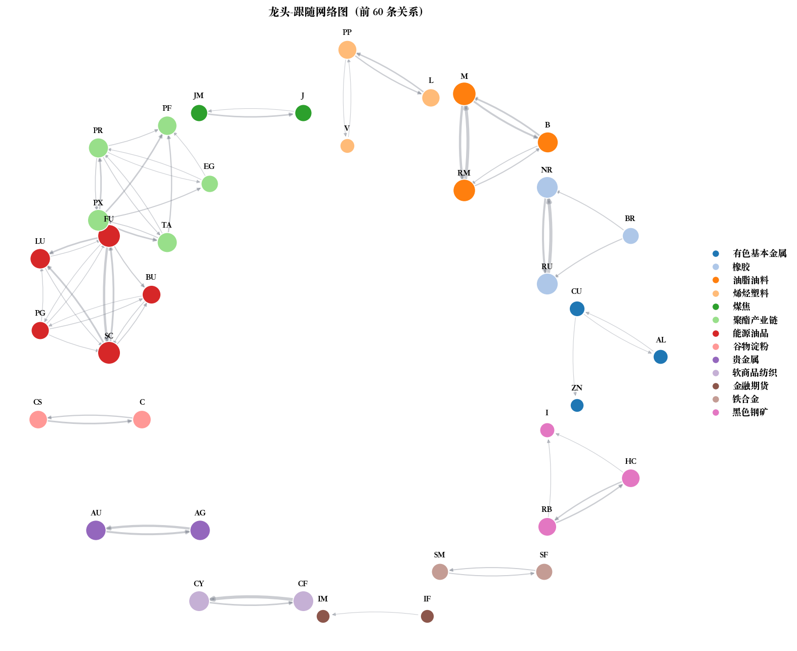

# 期货龙头与跟随品种识别逻辑报告

## 1. 这个项目在做什么

> 程序先把分钟行情合成“当前小时能看到的日 K”，然后看哪个品种最早突破自己过去 20 个交易日的高点或低点，同时涨跌幅和持仓变化都明显放大；这个品种就是该板块当前小时的龙头。找到龙头后，再在同板块里找当前同方向、并且过去 20 日收益率和龙头高度相关的品种，这些就是跟随品种。

## 2. 项目主线

主流程如下：

```text
分钟行情 CSV
    ↓
按交易日整理，夜盘归入下一个真实交易日
    ↓
生成完整日 K
    ↓
生成每小时“当前可见日 K”
    ↓
计算收益率、持仓变化、前 20 日高低点、前 20 日平均波动
    ↓
逐小时、逐板块识别龙头
    ↓
围绕每个龙头识别跟随品种
    ↓
输出 CSV 结果
```


## 3. 当前代码使用的阈值

| 参数 | 当前值 | 含义 |
| --- | ---: | --- |
| `HISTORY_DAYS` | 20 | 回看过去 20 个完整交易日。 |
| `RETURN_MULTIPLIER` | 3.0 | 当前涨跌幅绝对值要超过历史平均绝对涨跌幅的 3 倍。 |
| `OI_MULTIPLIER` | 2.0 | 当前持仓变化绝对值要超过历史平均绝对持仓变化的 2 倍。 |
| `CORRELATION_THRESHOLD` | 0.8 | 跟随品种和龙头的 20 日收益率相关系数至少为 0.8。 |
| `MIN_CORRELATION_DAYS` | 20 | 相关性计算至少需要 20 个有效样本。 |

## 4. 龙头识别条件

### 4.1 向上龙头条件

#### 向上龙头一句话总结

```text
向上龙头 =
    突破前 20 日高点
    + 当前上涨
    + 涨幅超过历史平均波动 3 倍
    + 当前增仓
    + 增仓幅度超过历史平均持仓变化 2 倍
```

#### 条件 1：有完整历史窗口

必须能拿到过去 20 个完整交易日的数据：

```text
prior_20_high_t 非空
avg_abs_return_20_t 非空
avg_abs_oi_change_20_t 非空
return_t 非空
oi_change_t 非空
```

#### 条件 2：价格向上突破前 20 日高点

```text
prior_20_high_t = max(high_{t-20}, high_{t-19}, ..., high_{t-1})
```

```text
high_{t,h} > prior_20_high_t
```

#### 条件 3：当前收益率为正

```text
return_t = close_t / close_{t-1} - 1
```

```text
return_{t,h} > 0
```

也就是当前是上涨的。

#### 条件 4：当前涨幅明显大于历史平均波动

```text
avg_abs_return_20_t =
mean(|return_{t-20}|, |return_{t-19}|, ..., |return_{t-1}|)
```

```text
|return_{t,h}| > 3.0 * avg_abs_return_20_t
```

解释：

如果过去 20 天这个品种平均每天绝对涨跌幅是 1%，那么当前涨幅要大于：

```text
3.0 * 1% = 3%
```

这样才算“涨得足够异常”。

#### 条件 5：当前持仓增加

```text
oi_change_t = open_interest_t / open_interest_{t-1} - 1
```

```text
oi_change_{t,h} > 0
```

也就是不只是价格涨，持仓也在增加。

#### 条件 6：当前增仓幅度明显大于历史平均持仓变化

```text
avg_abs_oi_change_20_t =
mean(|oi_change_{t-20}|, |oi_change_{t-19}|, ..., |oi_change_{t-1}|)
```

```text
|oi_change_{t,h}| > 2.0 * avg_abs_oi_change_20_t
```

解释：

如果过去 20 天这个品种平均持仓变化幅度是 2%，那么当前持仓变化要大于：

```text
2.0 * 2% = 4%
```

这样才算“增仓足够明显”。


### 4.2 向下龙头条件

某个品种要成为向下龙头，也必须同时满足 6 个条件。

```text
向下龙头 =
    跌破前 20 日低点
    + 当前下跌
    + 跌幅超过历史平均波动 3 倍
    + 当前减仓
    + 减仓幅度超过历史平均持仓变化 2 倍
```

## 5. 多个龙头候选怎么选

同一个板块、同一个小时、同一个方向里，可能多个品种都满足龙头条件。

这时程序按下面顺序排序：

1. `first_break_time` 越早越优先。
2. 如果突破时间一样，`|return|` 越大越优先。
3. 如果涨跌幅也一样，`|oi_change|` 越大越优先。
4. 如果还一样，品种代码按字母顺序排序。

公式化表达：

```text
leader =
arg sort by (
    first_break_time ascending,
    |return| descending,
    |oi_change| descending,
    symbol ascending
)
```

## 6. 跟随品种识别条件

### 条件 1：同板块

```text
group_j = group_L
```

### 条件 2：不能是龙头自己

```text
symbol_j != symbol_L
```

### 条件 3：当前方向和龙头一致

如果龙头是向上：

```text
return_{j,t,h} > 0
```

如果龙头是向下：

```text
return_{j,t,h} < 0
```

解释：

- 龙头上涨时，只找当前也上涨的品种。
- 龙头下跌时，只找当前也下跌的品种。

### 条件 4：过去 20 日收益率相关性足够高

程序计算龙头和候选品种过去 20 个交易日的日收益率相关系数。

设：

```text
R_L = 龙头过去 20 日收益率序列
R_j = 候选品种过去 20 日收益率序列
```

相关系数公式是标准 Pearson 相关系数：

```text
corr(L, j) =
cov(R_L, R_j) / (std(R_L) * std(R_j))
```

展开写就是：

```text
corr(L, j) =
Σ[(R_L,k - mean(R_L)) * (R_j,k - mean(R_j))]
/
sqrt(Σ(R_L,k - mean(R_L))^2 * Σ(R_j,k - mean(R_j))^2)
```

当前代码要求：

```text
corr(L, j) >= 0.8
```

### 跟随品种一句话总结

```text
跟随品种 =
    和龙头同板块
    + 当前方向和龙头一致
    + 过去 20 日收益率相关系数 >= 0.8
    + 有 20 个有效相关性样本
```


## 7. 输出结果怎么看

### 7.1 龙头结果表

输出文件：

```text
results/identification/leader_results.csv
```

重要字段：

| 字段 | 含义 |
| --- | --- |
| `识别时间` | 当前小时实际使用到的最后一条分钟数据时间。 |
| `交易日` | 所属交易日。 |
| `龙头品种` | 被识别出的龙头。 |
| `板块` | 龙头所属板块。 |
| `方向` | `向上` 或 `向下`。 |
| `当前涨跌幅` | `return_t`。 |
| `当前增减仓幅度` | `oi_change_t`。 |
| `前20日最高价或最低价` | 向上时是前 20 日最高价，向下时是前 20 日最低价。 |
| `前20日平均涨跌幅绝对值` | `avg_abs_return_20_t`。 |
| `前20日平均增减仓幅度绝对值` | `avg_abs_oi_change_20_t`。 |
| `首次突破时间` | 第一次突破高点或跌破低点的分钟时间。 |
| `历史窗口开始` | 前 20 日窗口开始日期。 |
| `历史窗口结束` | 前 20 日窗口结束日期。 |
| `触发原因` | 中文解释。 |

### 7.2 跟随结果表

输出文件：

```text
results/identification/follower_results.csv
```

重要字段：

| 字段 | 含义 |
| --- | --- |
| `识别时间` | 跟随信号对应的识别时间。 |
| `交易日` | 所属交易日。 |
| `龙头品种` | 已识别出的龙头。 |
| `跟涨品种` | 被识别出的跟随品种。向下时实际含义是跟跌。 |
| `板块` | 龙头和跟随品种共同所属板块。 |
| `方向` | 跟随龙头的方向，`向上` 或 `向下`。 |
| `20日收益率相关系数` | 龙头和候选品种过去 20 日收益率相关性。 |
| `相关样本数` | 实际用于计算相关性的交易日数量。 |
| `龙头当前涨跌幅` | 龙头当前小时收益率。 |
| `跟涨品种当前涨跌幅` | 跟随品种当前小时收益率。 |
| `触发原因` | 中文解释。 |


## 8. 总结

这个项目的识别逻辑可以压缩成两组公式。

龙头：

```text
向上龙头条件：
high_{t,h} > prior_20_high_t
return_{t,h} > 0
|return_{t,h}| > 3.0 * avg_abs_return_20_t
oi_change_{t,h} > 0
|oi_change_{t,h}| > 2.0 * avg_abs_oi_change_20_t

向下龙头条件：
low_{t,h} < prior_20_low_t
return_{t,h} < 0
|return_{t,h}| > 3.0 * avg_abs_return_20_t
oi_change_{t,h} < 0
|oi_change_{t,h}| > 2.0 * avg_abs_oi_change_20_t
```

跟随：

```text
group_j = group_L
direction_j = direction_L
corr(return_L_last_20_days, return_j_last_20_days) >= 0.8
sample_count >= 20
```

最终逻辑是：

> 先在每个板块里找“最早、最强、带持仓变化”的突破品种作为龙头，再找“同板块、同方向、历史走势相似”的品种作为跟随。


## 9.结果

### 9.1 龙头-跟随网络图



### 9.2 单次事件复盘图

[打开可切换事件复盘页面](https://ziyu-ge.github.io/Futures-Linkages/results/figures/event_review.html)
