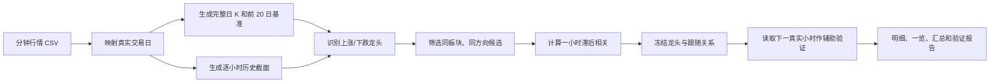

# 期货龙头与跟随品种识别算法说明

## 1. 我在做什么

这个项目是一个**基于确定性规则的历史事件识别器**。

它把分钟行情从旧到新逐小时回放，并且假设自己真的站在历史上的那个时点，只使用当时已经出现的数据，回答两个问题：

1. 这一小时里，某个期货板块是否出现了明显的上涨或下跌龙头？
2. 同板块中，哪些品种过去通常会晚一个小时跟随该龙头同向变化？

> 一句话解释：我不是简单找“今天涨得最多的品种”，而是同时看谁最早突破、涨跌是否显著、持仓变化是否异常；确认龙头后，再用过去 20 个交易日的小时联动关系寻找跟随品种。

这是一个透明、可复核的规则系统，不使用机器学习。它的主要目标是识别历史上的“龙头—跟随”关系，不是直接预测价格，也不是一套可以立即交易的策略。

## 2. 整体流程



算法的运行单位是：

```text
每个自然小时 × 每个板块 × 每个方向（上涨 / 下跌）
```

每个小时都是一次独立判断，因此同一个品种可能在连续几个小时都被识别为龙头。

## 3. 数据与时间口径

### 3.1 输入数据

当前项目的数据目录约 4.3 GB，包含 59 个期货品种，按产业关系划分为 17 个板块。一个 CSV 文件对应一个品种，例如 `RB.csv` 代表螺纹钢。

算法逐个品种读取，并且只使用以下六列：

| 字段 | 用途 |
|---|---|
| `datetime` | 确定分钟、小时和交易日 |
| `open` | 计算交易日开盘价 |
| `high` | 判断向上突破和日内最高价 |
| `low` | 判断向下突破和日内最低价 |
| `close` | 计算当前涨跌幅和小时收益率 |
| `open_interest` | 计算持仓变化幅 |

逐品种处理可以避免把全部分钟数据同时放入内存。

### 3.2 夜盘归属

夜盘归属于该品种**下一个真实存在日盘的交易日**，不是简单地给自然日期加一天。因此周末和节假日会被自动跨过。

例如，某个交易日的首次突破时间出现在前一天晚上 22:06 是正常的：前一晚夜盘和次日日盘属于同一个交易日。

### 3.3 小时截面

算法按自然小时分桶，取桶内最后一条有效分钟作为该品种在这一小时的状态。例如：

- `09:00:00—09:59:59` 使用最后一条有效分钟；
- 午间休市不会补造数据；
- 如果存在 `15:00` 这一条分钟数据，它会单独形成 `15:00` 小时桶。

“当下日 K”的最高价、最低价、收盘价和持仓量都只累计到当前截面，不使用本小时之后的数据。

### 3.4 历史窗口

每个识别时点只使用当前交易日之前的 20 个完整交易日。计算时先向后移动一天，再做 20 日滚动，因此识别当日不会进入历史基准。

历史不足 20 个完整交易日时，不做识别。

## 4. 指标定义

### 4.1 当前小时可见的日内指标

设当前小时末价格为 \(P_t\)，交易日第一条记录的开盘价为 \(P_0\)，当前持仓量为 \(OI_t\)，交易日第一条记录的持仓量为 \(OI_0\)：

$$
当前涨跌幅 = \frac{P_t}{P_0} - 1
$$

$$
当前持仓变化幅 = \frac{OI_t}{OI_0} - 1
$$

这里的涨跌幅是“当前价格相对当日开盘”的变化，不是昨收至当前的变化。

### 4.2 前 20 日历史基准

对每个完整交易日分别计算：

$$
每日涨跌幅 = \frac{日收盘价}{日开盘价} - 1
$$

$$
每日持仓变化幅 = \frac{日末持仓量}{日初持仓量} - 1
$$

然后用前 20 个完整交易日得到四个基准：

- 前 20 日最高价；
- 前 20 日最低价；
- 前 20 日每日涨跌幅绝对值的平均值；
- 前 20 日每日持仓变化幅绝对值的平均值。

使用绝对值均值，是为了衡量该品种自身平时的波动和持仓变化强度。这样不同价格、不同波动水平的品种可以按各自历史状态进行比较。

这里用的是绝对变化的平均值，不是标准差。因此“2.0 倍”只是人为设定的强度门槛，不能解释成“两倍标准差”或固定的统计置信水平。

如果分母为 0 或必需字段缺失，该品种在相应时点不参与识别。

## 5. 第一步：识别龙头

龙头需要同时通过“突破、价格异动、持仓异动”三道门槛。

### 5.1 上涨龙头

上涨候选必须同时满足：

```text
当前涨跌幅 > 0
当前最高价 > 前 20 日最高价
|当前涨跌幅| > 2.0 × 前 20 日平均绝对涨跌幅
|当前持仓变化幅| > 1.5 × 前 20 日平均绝对持仓变化幅
首次向上突破时间 <= 当前识别时间
```

### 5.2 下跌龙头

下跌候选必须同时满足：

```text
当前涨跌幅 < 0
当前最低价 < 前 20 日最低价
|当前涨跌幅| > 2.0 × 前 20 日平均绝对涨跌幅
|当前持仓变化幅| > 1.5 × 前 20 日平均绝对持仓变化幅
首次向下突破时间 <= 当前识别时间
```

持仓条件使用的是变化幅的**绝对值**，所以异常增仓和异常减仓都可能通过；它表达的是“持仓行为异常”，并不等同于只筛选增仓品种。

### 5.3 多个候选如何选出唯一龙头

同一板块、同一方向如果有多个品种同时通过三道门槛，依次按以下顺序排序：

1. 首次突破时间更早；
2. 当前涨跌幅绝对值更大；
3. 当前持仓变化幅绝对值更大；
4. 品种代码字母顺序更靠前。

最后一条是稳定的兜底规则，可以保证相同数据每次运行都得到相同结果。

需要注意，“首次突破时间”可能早于最终识别时间。只有当突破、涨跌幅和持仓变化三项在当前小时同时满足时，算法才会在该小时正式识别出龙头。

## 6. 第二步：识别跟随品种

只有某板块已经出现龙头时，算法才寻找跟随品种。

### 6.1 先筛选同板块、同方向品种

候选跟随品种必须：

- 与龙头属于同一板块；
- 不是龙头自身；
- 当前累计涨跌幅与龙头同号。

跟随候选不需要自己突破前 20 日高低点，也不需要通过龙头的 2.0 倍涨跌幅和 1.5 倍持仓门槛。

### 6.2 再计算一小时滞后相关性

算法用当前交易日之前 20 个完整交易日的小时收益率，计算：

$$
\rho = corr\left(r^{leader}_{t-1},\ r^{follower}_{t}\right)
$$

它描述的是：龙头在上一自然小时的变化，与候选品种在当前自然小时的变化是否经常同向。

实现时会把龙头的时间键向后移动一个小时，再按真实的“交易日 + 自然小时”与候选品种连接。它不是把两张表按行号错开一行，因此午休、夜盘等较长空档不会被误认为一小时滞后。

日期边界采用龙头对应的前 20 日窗口，再通过内连接只保留双方共同有效的小时样本。如果两个品种的交易日历不同，最终共同样本不等于双方各自完整的 20 个交易日，所以还要用“至少 30 个共同样本”进行约束。

小时收益率的具体定义是：

$$
小时收益率 = \frac{当前小时桶的收盘价}{前一个真实存在小时桶的收盘价} - 1
$$

因此，“一小时滞后”是算法中的时间标签口径：配对的龙头与跟随收益必须位于相差一个自然小时的桶，但每个收益率自身覆盖的实际时长不一定恰好是 60 分钟。例如，休市前后两个真实小时桶之间可能相隔更久，而 `14:59` 到单独的 `15:00` 桶可能只有一分钟。它不能被解释为严格经济时间上的 60 分钟因果效应。

候选成为跟随品种还必须满足：

```text
共同有效小时样本数 >= 30
有符号相关系数 >= 0.30
```

这里使用正的有符号相关系数，不取绝对值。多个合格跟随品种全部保留，并按相关系数从高到低排序。

相关系数使用 Pearson 相关。样本不足 30 个、任一序列没有有效波动或相关系数无法计算时，候选都不会入选。`0.30` 表示线性相关系数门槛，不表示“30% 的跟随概率”。

相关性只能说明历史联动，不能证明龙头在经济意义上“导致”跟随品种变化。

## 7. 第三步：用下一小时做辅助验证

龙头和跟随品种已经确定并冻结之后，算法才读取跟随品种的下一个真实交易小时收益率。

```text
上涨方向：方向收益 = 下一小时收益率
下跌方向：方向收益 = -下一小时收益率
方向收益 > 0：记为“后续同向”
```

这里取的是时间序列中下一条真实存在的小时数据。遇到午休、夜盘间隔或跨交易日时，不会人为填充不存在的交易小时。

需要区分两个口径：

| 场景 | 时间处理方式 |
|---|---|
| 判断历史上的“一小时领先关系” | 必须严格相差一个自然小时，休市空档不配对 |
| 事后查看下一小时表现 | 读取下一条真实存在的交易小时，自动跨过休市空档 |

下一小时结果不参与龙头或跟随品种筛选，只是事后检查关系出现后市场如何变化。

## 8. 用一个真实结果解释

以 2019-08-23 14:59 的油脂油料板块为例：

| 判断项 | A（豆一）的实际值 | 当时门槛 | 结论 |
|---|---:|---:|---|
| 首次向上突破 | 前一晚 22:06 发生 | 必须不晚于识别时间 | 通过 |
| 当前涨跌幅 | 1.697127% | 0.850931% | 通过 |
| 当前持仓变化幅绝对值 | 5.358513% | 4.619453% | 通过 |

因此 A 被识别为上涨龙头。

同一时点，B（豆二）与 A 同属油脂油料板块、当前方向相同，并且历史一小时滞后相关系数为 `0.3089858503`，共同样本数为 120，因此 B 被识别为跟随品种。

关系冻结后，B 在下一个真实小时的收益率为 `0.401388%`，方向与上涨识别一致。这只是这一条关系的事后验证，不是 B 成为跟随品种的原因。

## 9. 防止未来数据的措施

| 可能的未来数据风险 | 算法的处理方式 |
|---|---|
| 历史窗口误含识别当日 | 先 `shift(1)`，再滚动 20 日 |
| 使用当前小时之后的日内高低点 | 日内最高、最低按小时累计到当前截面 |
| 提前使用尚未发生的突破 | 强制要求首次突破时间不晚于当前截面 |
| 午休或隔夜被误当作一小时滞后 | 使用真实自然小时键连接，不按相邻行配对 |
| 下一小时表现影响筛选 | 先冻结识别结果，再查询下一真实小时 |

除此之外，程序还会重新从原始分钟数据回算一个上涨和一个下跌样例、核对历史窗口、抽查滞后方向、对账明细与一览，并重复运行比较输出文件是否完全一致。这些验证证明规则实现和运行结果可复核、可重复，但不等于证明算法具有预测有效性。

## 10. 当前实际配置

本说明以 `code/config.py` 的实际运行配置为准：

| 参数 | 当前值 | 含义 |
|---|---:|---|
| `HISTORY_DAYS` | 20 | 历史完整交易日数量 |
| `RETURN_MULTIPLIER` | 2.0 | 涨跌幅异常倍数 |
| `OI_MULTIPLIER` | 1.5 | 持仓变化异常倍数 |
| `MIN_CORRELATION_SAMPLES` | 30 | 计算相关性的最少共同样本数 |
| `CORRELATION_THRESHOLD` | 0.30 | 跟随品种的相关性门槛 |
| `OUTPUT_ONLY_WITH_FOLLOWERS` | `True` | 输出只保留至少有一个跟随品种的龙头截面 |

### 必须说明的两个口径差异

1. 原始任务说明 `prompt.md` 中的相关性门槛写为 `0.60`，当前实际代码使用 `0.30`。现有结果也是按 `0.30` 生成的。当前运行实际评估到的最高相关系数约为 `0.4781`，所以若直接改回 `0.60`，现有候选窗口都无法成为跟随关系，必须重新运行并重新解释输出。
2. 原始任务说明要求保留“有龙头但没有跟随品种”的记录，当前配置则会在输出阶段删除这些记录。因此现有汇总中的“龙头识别数量”，准确含义是**输出中保留下来的、至少有一个合格跟随品种的龙头小时截面数**，不是三道龙头规则触发的全部次数。

受第二项配置影响，当前汇总表中的“龙头识别数量”和“有跟随品种的识别数量”必然相等。

## 11. 当前历史结果应如何理解

当前输出覆盖的识别时间为 2018-08-15 23:59 至 2026-04-22 15:00。按当前参数和“只输出有跟随者”口径：

- 保留了 93 个龙头小时截面，其中上涨 53 个、下跌 40 个；
- 展开后得到 103 条“龙头—跟随”关系，因为部分龙头有多个跟随品种；
- 103 条关系都有下一小时样本，其中 56 条后续同向，比例为 54.37%；
- 平均下一小时方向收益约为 -0.0593%，中位数约为 +0.0108%。

如果暂时忽略小时，只按“交易日 + 板块 + 方向 + 龙头”去重，93 个小时截面对应 35 个不同组合。这只是帮助理解重复程度的观察，不是程序当前输出的一项正式统计。

这些结果只能作为当前样本和阈值下的辅助描述，不能直接称为交易策略收益，原因包括：

- 连续小时可能重复识别同一事件，同一龙头也可能有多个跟随者，103 条样本并不独立；
- 相关性不代表因果关系，也不保证未来继续有效；
- 20 日窗口和固定阈值可能随市场环境变化而失效；
- 样本量较小，且不同板块的样本分布不均；
- 没有信号去重、开平仓规则、手续费、滑点、资金管理和风险约束。

另外，当前相关筛选评估过 8,592 个可计算的候选窗口，但没有做多重检验校正、显著性检验、置信区间或独立样本外测试，存在偶然相关和阈值选择风险。代码也没有主动处理主力合约换月/复权、流动性、涨跌停和可成交性，这些质量依赖输入数据或后续研究补充。

所以 54.37% 不能直接称为分类准确率或交易胜率；平均方向收益为负而中位数略为正，也说明“同向次数略多”不等于具有正的经济收益。

因此，这套算法目前更适合用来建立一份可检索、可解释、可复核的历史事件库，并为后续研究提供候选关系。

## 12. 输出文件怎么用

| 文件 | 粒度 | 主要用途 |
|---|---|---|
| `leader_follower_overview.csv` | 一个历史小时、板块、方向一行 | 快速回答“当时谁是龙头、谁在跟随” |
| `leader_follower_detail.csv` | 一个龙头—跟随品种一行 | 复核阈值、相关性、样本数和下一小时表现 |
| `identification_summary.csv` | 整体或板块×方向一行 | 查看数量和辅助验证统计 |
| `validation_report.txt` | 一项验证一段 | 检查规则、时间方向、无未来数据和结果一致性 |

最适合日常浏览的是一览表；需要解释某一条结果为什么入选时，再查看明细表。

## 13. 伪代码

```text
逐个品种读取分钟数据
    映射夜盘所属交易日
    生成完整日 K 和前 20 日历史基准
    生成每个自然小时可见的日内状态

按时间从旧到新遍历每个小时
    对每个板块
        对上涨、下跌分别处理
            用突破 + 涨跌异动 + 持仓异动筛选龙头候选
            按确定性排序选出唯一龙头
            在同板块、同方向品种中计算一小时滞后相关
            保留样本数和相关系数达到门槛的所有跟随品种
            冻结本小时识别结果
            查询跟随品种下一真实小时，仅作辅助验证

生成明细表、一览表、汇总表和验证报告
```

## 14. 对外讲解时可以直接这样说

> 我做的是一个期货板块联动的历史识别系统。程序会把分钟行情按历史顺序逐小时回放，每到一个小时，就只用当时已经出现的信息判断。龙头必须同时满足三个条件：它最早突破过去 20 个交易日的高点或低点，当前涨跌幅明显超过自身历史水平，而且持仓变化也明显异常。如果同一板块有多个候选，就按突破时间、涨跌强度和持仓变化依次排序，只选一个。确认龙头后，我再看同板块中方向一致的其他品种，并用过去 20 天的数据检查它是否经常晚一个小时跟随龙头。最后才查看下一真实小时的表现作辅助验证。整个过程不使用机器学习，也不把未来数据放进筛选，所以每一条结果都能回到原始分钟行情中解释和复核。

## 15. 运行方式与代码位置

安装依赖并运行全量识别：

```bash
python3 -m pip install -r requirements.txt
python3 code/run_identification.py
```

限制识别日期：

```bash
python3 code/run_identification.py --start 2024-01-01 --end 2024-12-31
```

主要代码位置：

- 参数与输出口径：[`code/config.py`](code/config.py)
- 数据和时间处理：[`code/market_data.py`](code/market_data.py)
- 龙头与跟随识别：[`code/identify.py`](code/identify.py)
- 结果表生成：[`code/report.py`](code/report.py)
- 自动验证：[`code/validate.py`](code/validate.py)
- 命令行入口：[`code/run_identification.py`](code/run_identification.py)
